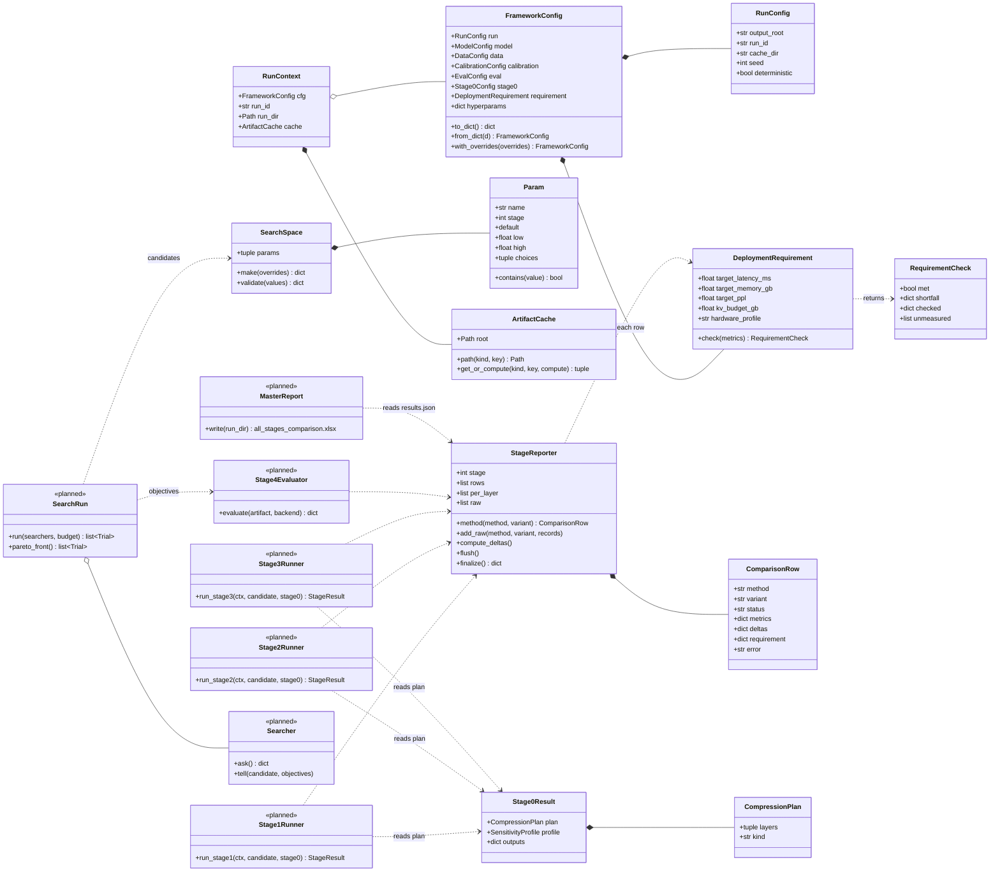
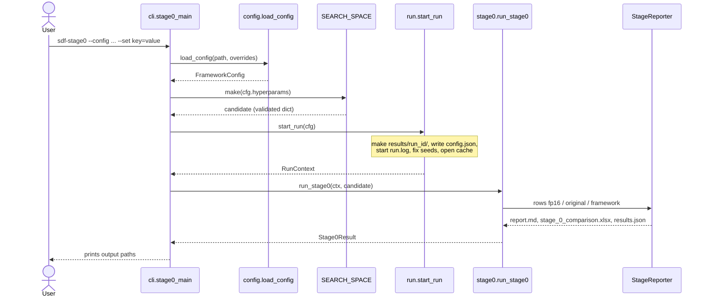
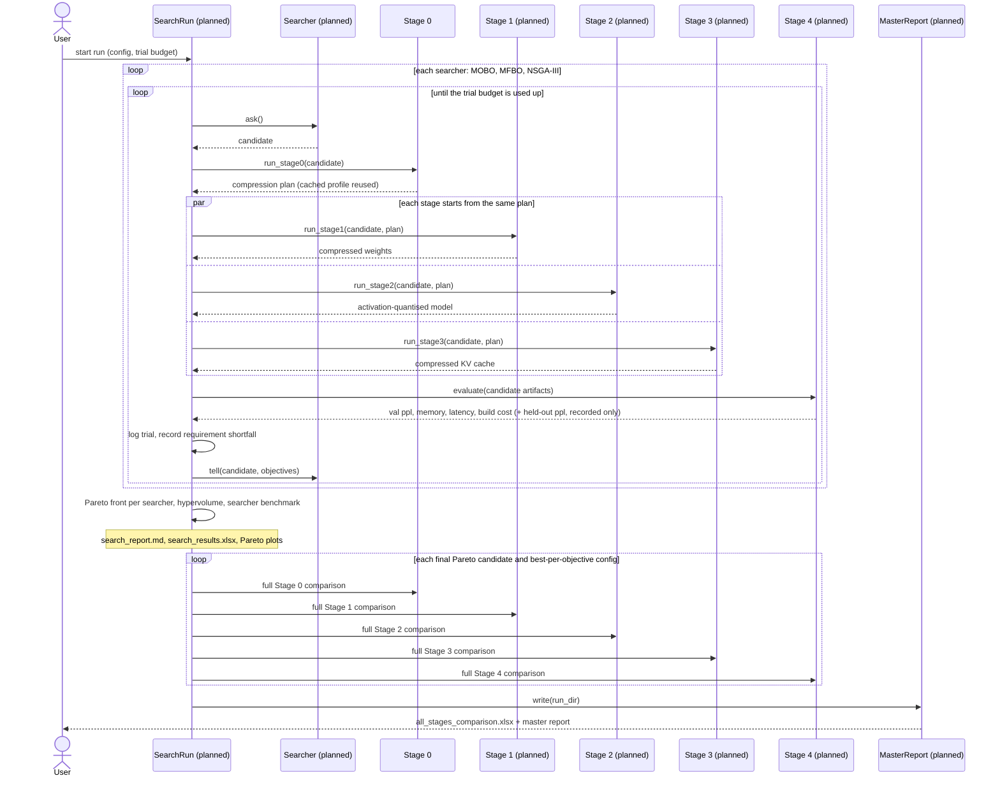

# Diagrams

Class and sequence diagrams for the whole framework and for each stage. GitHub draws them from the Mermaid
text in these files.

| File | Covers | Drawn from |
|---|---|---|
| this file | the project as a whole | the code (Stage 0 and shared parts) + the design (the rest) |
| [stage0.md](stage0.md) | Stage 0: sensitivity profiling and planning | the code |
| [stage1.md](stage1.md) | Stage 1: weight compression | the design, **planned** |
| [stage2.md](stage2.md) | Stage 2: activation compression | the design, **planned** |
| [stage3.md](stage3.md) | Stage 3: KV-cache compression | the design, **planned** |
| [stage4.md](stage4.md) | Stage 4: evaluation across backends | the design, **planned** |
| [search.md](search.md) | the search layer (MOBO, MFBO, NSGA-III) | the design, **planned** |

Anything not written yet carries a `<<planned>>` label. Planned parts follow the flow of the v2_1 design diagram and the
thesis spec, and reuse the shared pieces that already exist (`FrameworkConfig`, `StageReporter`,
`ArtifactCache`, `measure_model`), so each new stage only adds its own methods. Names of planned classes and
functions are proposals and may change when the stage is written.

## How to read these diagrams

- A **class diagram** is a map of the parts of the program and how they connect. Each box is one kind of thing
  the program keeps track of (for example "a compression plan"), with the pieces of information it holds and the
  actions it can do. A line with a diamond means "is made of"; a dashed arrow means "uses".
- A **sequence diagram** is a timeline. Each column is a part of the program; arrows going down the page are
  the steps, in order, as one part asks another to do something and gets an answer back. `loop` boxes repeat,
  `alt` boxes show a choice, `opt` boxes are skipped when they don't apply.

## The project in plain words

The framework makes a language model smaller and faster while keeping its answers good. First it measures
which layers of the model are fragile (**Stage 0**). It then uses that measurement to decide how hard to
compress each layer, and applies three separate kinds of compression: to the model's stored numbers
(**Stage 1**), to the numbers it computes while running (**Stage 2**), and to its short-term memory of the
conversation (**Stage 3**). **Stage 4** measures the result on real software that runs models. Around all of
this, a **search** tries many settings and keeps the ones that give the best trade-off between accuracy, memory
and speed.

Every stage is judged the same way: the uncompressed model, the standard compression method on its own, and
the framework's sensitivity-guided version, all under identical conditions.

## Class diagram: the project as a whole

`FrameworkConfig` also holds `ModelConfig`, `DataConfig`, `CalibrationConfig`, `EvalConfig` and `Stage0Config`
(left out above for space; see [stage0.md](stage0.md)). Stages 1 to 4 will add their own `StageNConfig` block
to it, so there is still one config object.

## Sequence diagram: a Stage 0 run today

What happens when you type `sdf-stage0 --config configs/tinyllama.yaml`. Stage 0's inside is expanded in
[stage0.md](stage0.md).

## Sequence diagram: the full run (planned)

The whole pipeline once the search exists. Each searcher runs its own loop over the same search space and trial
budget; their results are compared, not pooled into one search.

