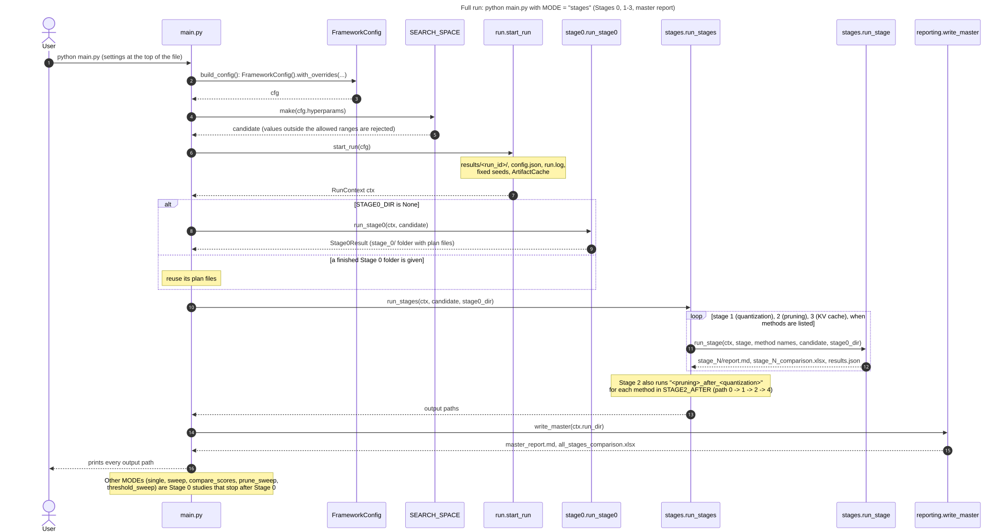
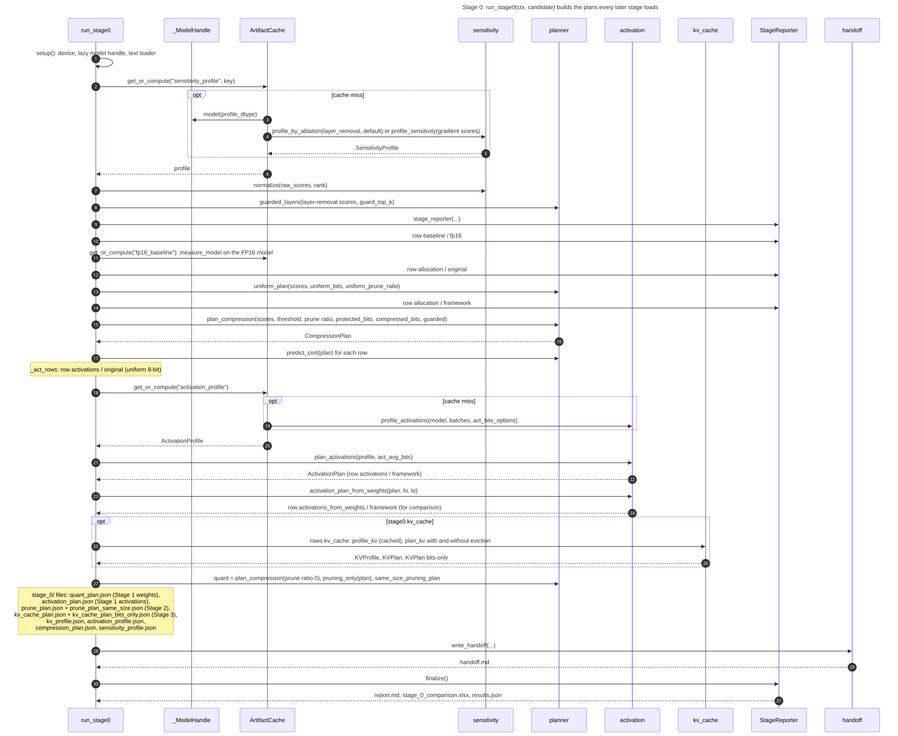
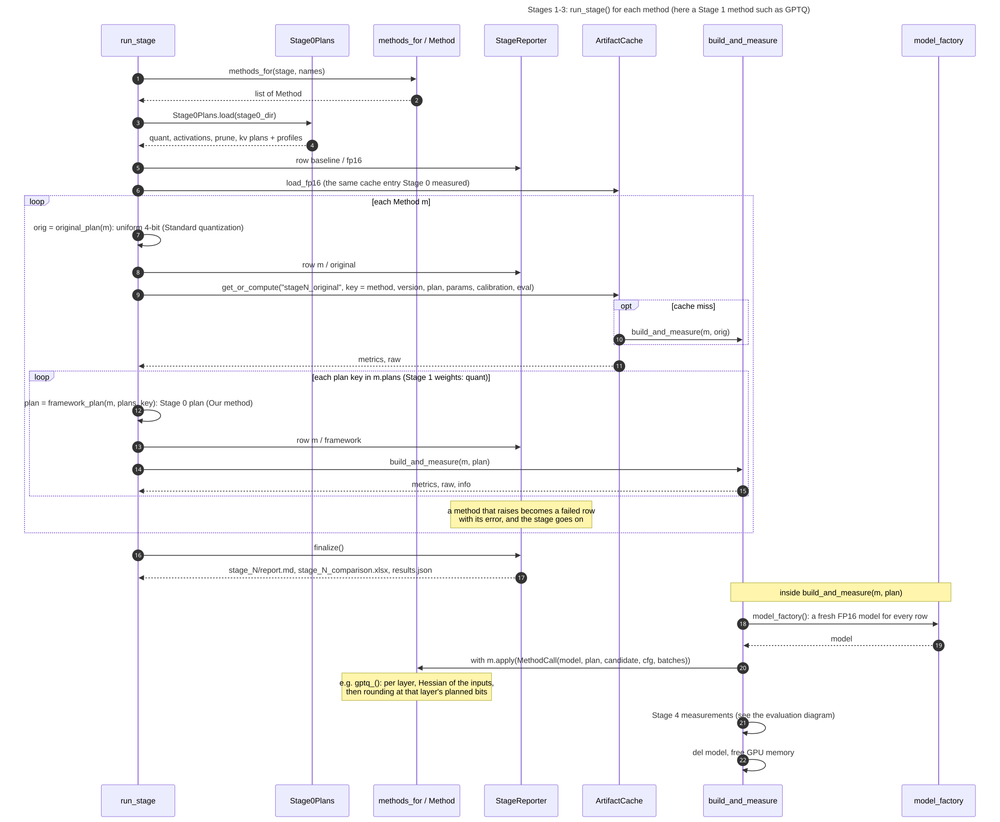
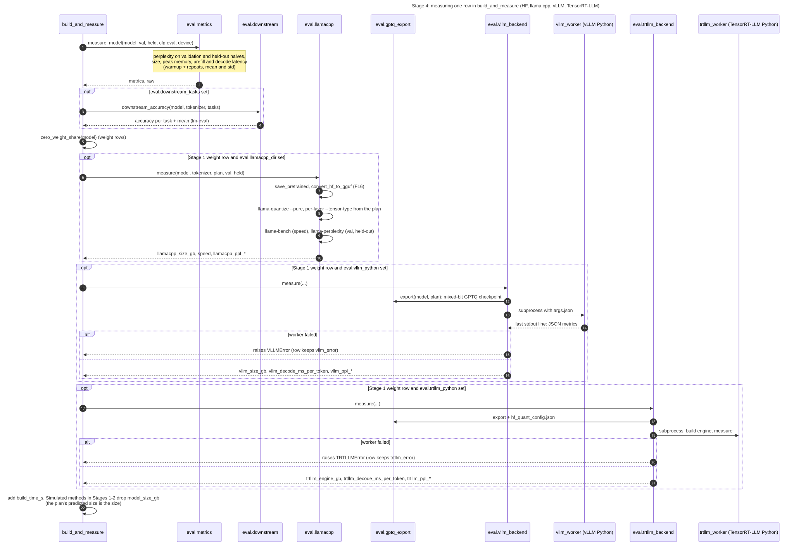

# Diagrams

Class and sequence diagrams of the code on `main` (2026-10-10), drawn from the source. Each diagram has a Mermaid
source (`.mmd`), a vector image (`.svg`) and a picture (`.png`). The planned search layer is in [search.md](search.md).

Condition names: **Standard quantization** (`original` rows in the code) puts every layer at one bit length
(uniform 4-bit, group size 128); **Our method** (`framework` rows) follows the Stage 0 plan, mixing bit lengths per layer.
Stage 1 is quantization only, Stage 2 pruning only, Stage 3 KV cache only; Stage 4 measures every row.

## How to read them

- **Class diagram**: a map of the program's parts. A box is a kind of thing the program keeps (a plan, a profile)
  or a module (`<<module>>`). A line with a filled diamond means "is made of", a hollow diamond "holds", a hollow
  triangle "is a kind of", a dashed arrow "uses".
- **Sequence diagram**: a timeline. Each column is a part of the program; arrows go down the page in order.
  `loop` repeats, `alt` is a choice, `opt` is skipped when it does not apply.

## Class diagrams

| Diagram | Shows | Files |
|---|---|---|
| Core | the one config object, the run folder, the cache, the search space | [mmd](class-core.mmd) · [svg](class-core.svg) · [png](class-core.png) |
| Stage 0 | sensitivity profiles and the weight, activation and KV cache plans | [mmd](class-stage0.mmd) · [svg](class-stage0.svg) · [png](class-stage0.png) |
| Stages 1-3 | the method table and the runner shared by Stages 1, 2 and 3 | [mmd](class-stages.mmd) · [svg](class-stages.svg) · [png](class-stages.png) |
| Stage 4 and reports | the four backends (HF, llama.cpp, vLLM, TensorRT-LLM) and the report writers | [mmd](class-eval-reporting.mmd) · [svg](class-eval-reporting.svg) · [png](class-eval-reporting.png) |






## Sequence diagrams

| Diagram | Shows | Files |
|---|---|---|
| Full run | `python main.py` with `MODE = "stages"`: Stage 0, Stages 1-3, master report | [mmd](seq-full-run.mmd) · [svg](seq-full-run.svg) · [png](seq-full-run.png) |
| Stage 0 | how `run_stage0` builds and saves the plans | [mmd](seq-stage0.mmd) · [svg](seq-stage0.svg) · [png](seq-stage0.png) |
| One method in Stages 1-3 | the Standard quantization row (cached) and the Our method row for one method | [mmd](seq-stage-method.mmd) · [svg](seq-stage-method.svg) · [png](seq-stage-method.png) |
| Stage 4 | measuring one row on HF, llama.cpp, vLLM and TensorRT-LLM | [mmd](seq-stage4-eval.mmd) · [svg](seq-stage4-eval.svg) · [png](seq-stage4-eval.png) |






## Redrawing

```bash
npm install @mermaid-js/mermaid-cli@11.4.2
for f in docs/diagrams/*.mmd; do
  npx mmdc -i "$f" -o "${f%.mmd}.svg"
  npx mmdc -i "$f" -o "${f%.mmd}.png" -s 2 -w 2400 -b white
done
```
