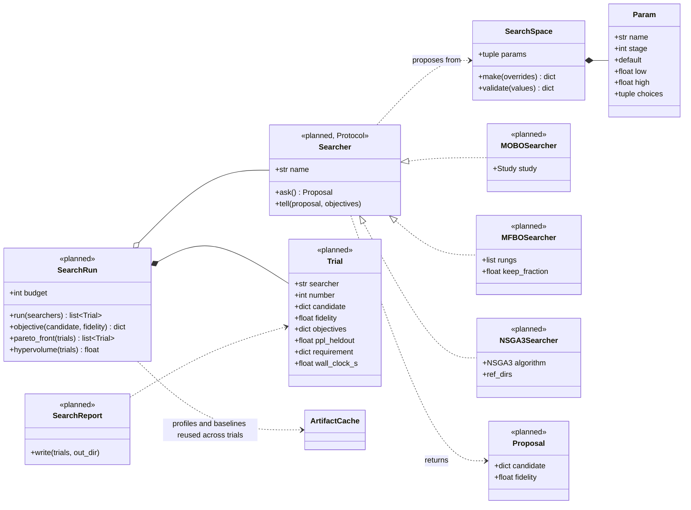
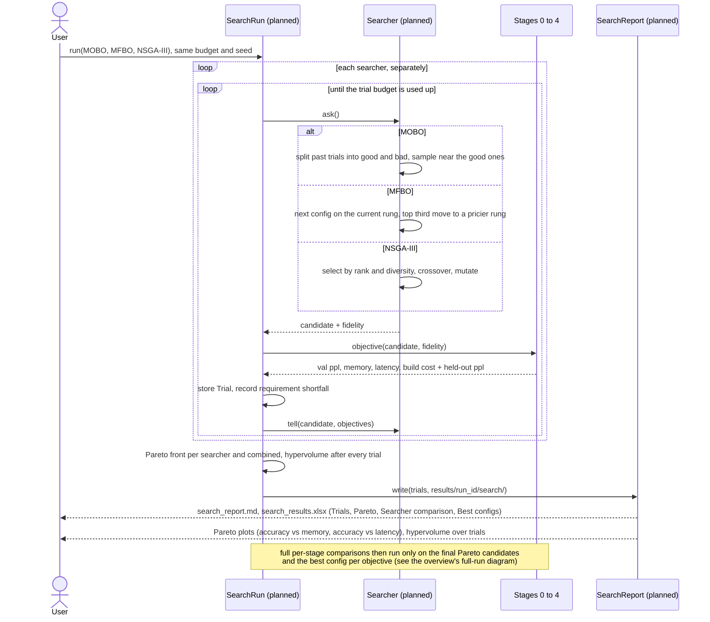

# Search layer (planned)

Not written yet, except the search space itself (`src/sdf/search_space.py`). Drawn from the design (v2_1
diagram, "Search Loop" page) and the thesis spec; other names are proposals. Back to the [overview](README.md).

## In plain words

The framework has a handful of settings (how strict the "fragile layer" threshold is, how much to prune, how
many bits to keep, which calibration text to use, and so on). Each combination gives a different balance of
accuracy, memory, speed and build time, and no single one is best on all four. The search tries many
combinations and keeps the **Pareto front**: the ones that nothing else beats on every goal at once.

Three search strategies are compared, each with the same settings to choose from and the same number of tries:

- **MOBO** (Optuna) learns from past tries which regions look promising.
- **MFBO** (successive halving) tests many settings cheaply, then re-tests only the best third more carefully.
- **NSGA-III** (pymoo) evolves a population: it keeps good, varied settings and combines them into new ones.

Their results are kept separate and benchmarked: how fast each finds good settings and how much of the best
combined front it contributes.

## Class diagram

Objectives (all minimised): validation-half perplexity, memory, latency, build cost. Held-out perplexity is
stored on every `Trial` but never returned to a searcher. `SEARCH_SPACE` today holds `sensitive_threshold`,
`prune_ratio_aggressive`, `calib_dataset`, `calib_samples` and `gptq_groupsize`; `smoothquant_alpha` and
`quarot_k_bits` join it with Stages 2 and 3.

## Sequence diagram

