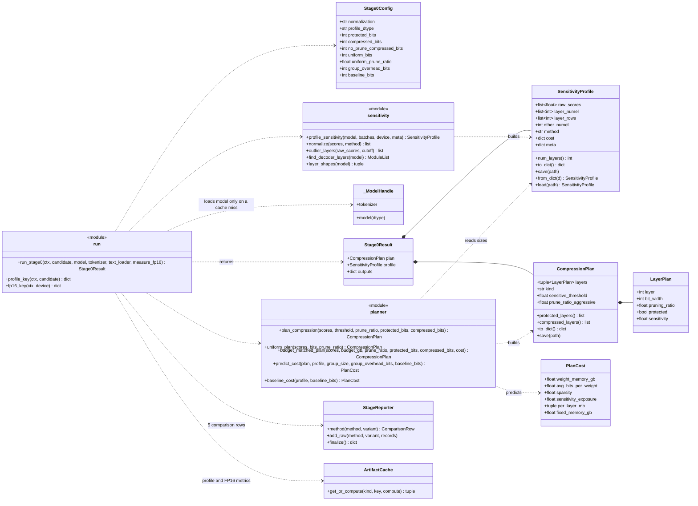
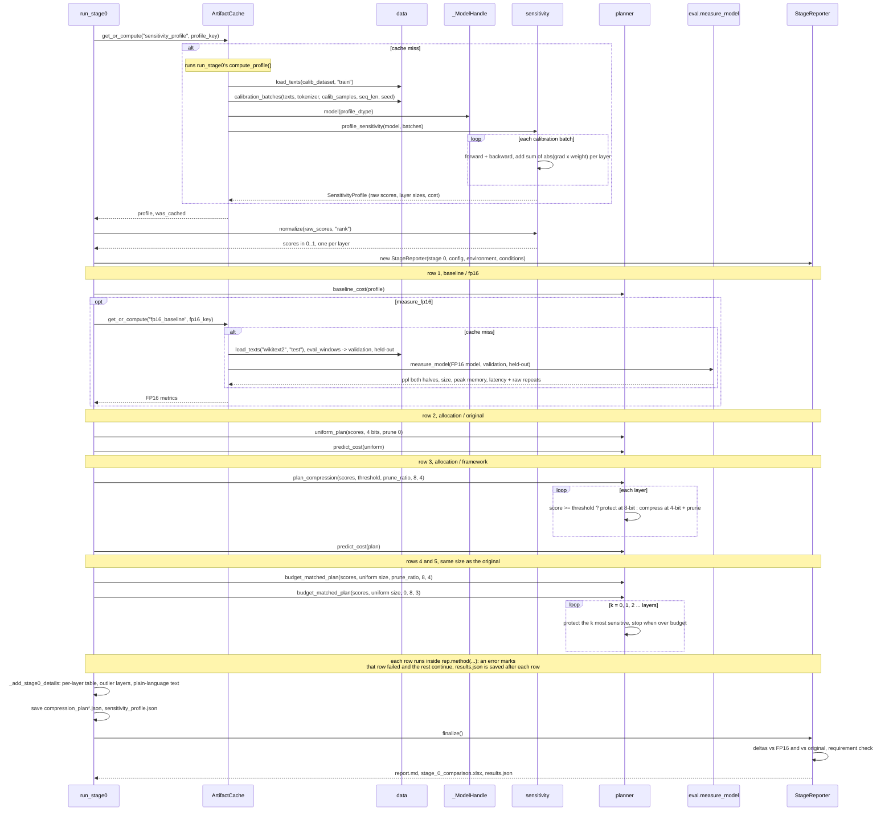

# Stage 0: sensitivity profiling and compression planning

Drawn from the code in `src/sdf/stage0/`. Back to the [overview](README.md).

## In plain words

Stage 0 finds out which layers of the model are fragile. It feeds the model some ordinary text and, for every
layer, estimates how much the model's predictions would suffer if that layer's numbers were changed. That
estimate is the layer's **sensitivity score**. Layers scoring at or above a threshold are **protected** (kept at
8 bits, nothing removed); the rest are **compressed** (4 bits, and some of their numbers removed). The result is
a **compression plan**: one line per layer saying how many bits it gets and how much of it is removed.

Stage 0 does not compress anything yet. It predicts how much memory each plan would need and compares:

- the **uncompressed** model (FP16),
- the **standard method**: every layer treated the same (uniform 4 bits),
- the **framework**: the sensitivity plan, plus two versions squeezed into exactly the standard method's memory
  (one that removes numbers from robust layers, one that only lowers their bits), so the comparison is fair.

Measuring the sensitivity is the slow part, so the scores are saved and reused by every later trial that uses
the same model and calibration text.

## Class diagram

`sensitivity`, `planner` and `run` are the modules `sdf.stage0.sensitivity`, `sdf.stage0.planner` and
`sdf.stage0.run`; they hold plain functions, not classes. `StageReporter` and `ArtifactCache` are shared by
every stage (see the [overview](README.md)).

## Sequence diagram

`run_stage0(ctx, candidate)`, step by step. The candidate supplies `sensitive_threshold`,
`prune_ratio_aggressive`, `calib_dataset`, `calib_samples` and `gptq_groupsize` (used only to predict memory).

