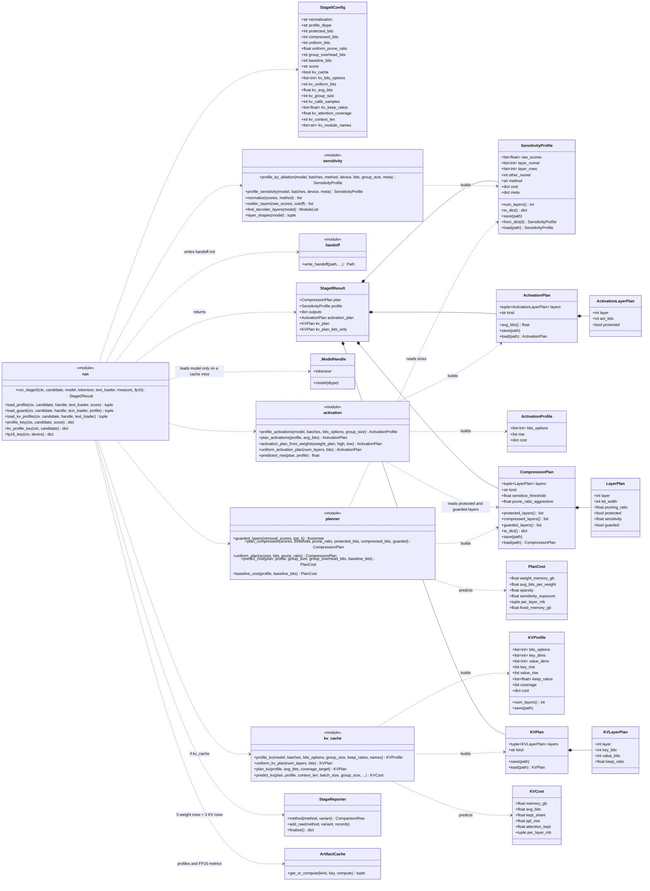
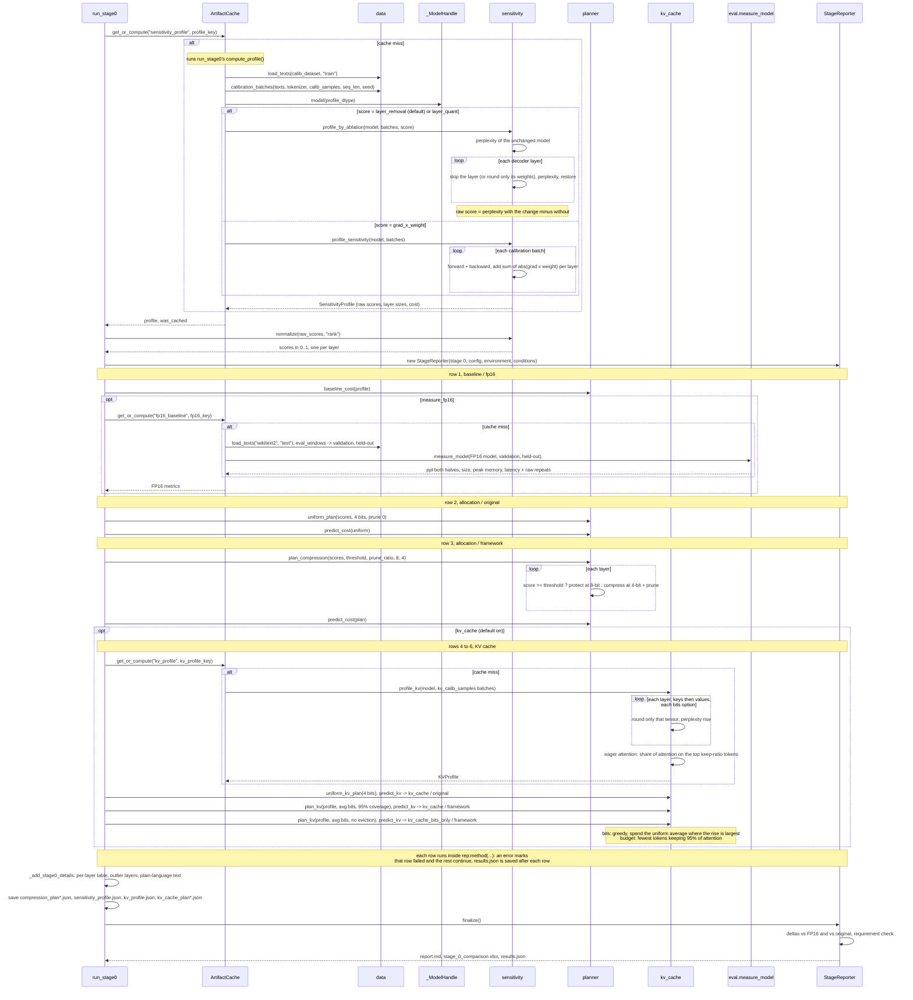

# Stage 0: sensitivity profiling and compression planning

Drawn from the code in `src/sdf/stage0/`. Back to the [overview](README.md).

## In plain words

Stage 0 finds out which layers of the model are fragile. It feeds the model some ordinary text and, for every
layer, measures how much worse the model gets when that layer is removed (skipped): the rise in perplexity is
the layer's **sensitivity score**. This **layer removal** score is the default; two other ways can be picked
with `SENSITIVITY_SCORE` in `main.py`: compressing only that layer (`layer_quant`), or a one-pass estimate from
the size of each number times its gradient (`grad_x_weight`). Layers scoring at or above a threshold are **protected** (kept at
8 bits, nothing removed); the rest are **compressed** (4 bits, and some of their numbers removed). The result is
a **compression plan**: one line per layer saying how many bits it gets and how much of it is removed.

Stage 0 does not compress anything yet. It predicts how much memory each plan would need and compares:

- the **uncompressed** model (FP16),
- the **standard method**: every layer treated the same (uniform 4 bits),
- the **framework**: the sensitivity plan, plus two versions squeezed into exactly the standard method's memory
  (one that removes numbers from robust layers, one that only lowers their bits), so the comparison is fair.

Stage 0 also plans the model's short-term memory while it writes, the **KV cache**. For every layer it measures
how much perplexity rises when only that layer's keys (then values) are rounded to 2, 4 or 8 bits, and gives
more bits where rounding hurts most, keeping the same average as a uniform 4-bit cache. It also finds, per
layer, the fewest earlier words that still get 95% of the layer's attention (a **token budget**), and predicts
the cache's memory at 2,048 tokens. The report compares the uniform 4-bit cache, the full plan, and the plan
with bits only (nothing forgotten).

Measuring the sensitivity is the slow part, so the scores are saved and reused by every later trial that uses
the same model and calibration text.

## Class diagram

`sensitivity`, `planner`, `kv_cache` and `run` are the modules `sdf.stage0.sensitivity`, `sdf.stage0.planner`,
`sdf.stage0.kv_cache` and `sdf.stage0.run`; they hold plain functions, not classes. `profile_by_ablation` gives
the `layer_removal` (default) and `layer_quant` scores; `profile_sensitivity` gives `grad_x_weight`. `StageReporter` and `ArtifactCache` are shared by
every stage (see the [overview](README.md)).

## Sequence diagram

`run_stage0(ctx, candidate)`, step by step. The candidate supplies `sensitive_threshold`,
`prune_ratio_aggressive`, `calib_dataset`, `calib_samples` and `gptq_groupsize` (used only to predict memory).

