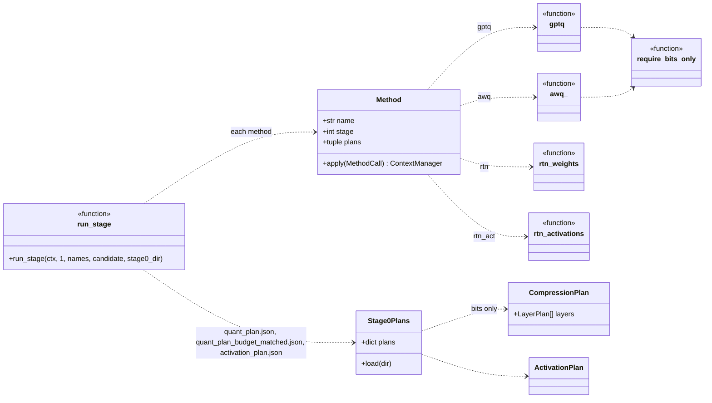
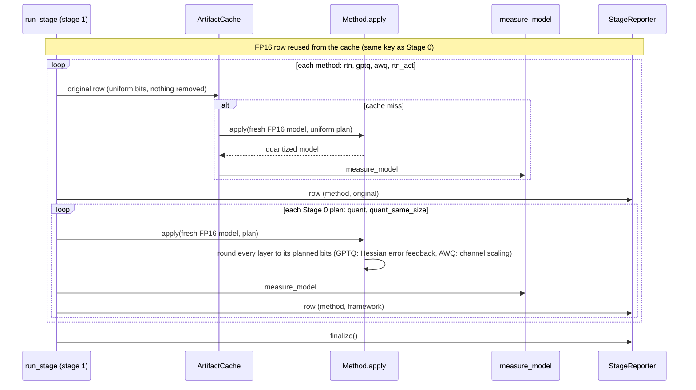

# Stage 1: quantization

Drawn from the code (`src/sdf/stages/`). Weights are implemented (RTN, GPTQ, AWQ); of the activation methods only
the RTN baseline is. Back to the [overview](README.md).

## In plain words

A model is billions of stored numbers ("weights") and, while it runs, computes new numbers at every step
("activations"). Stage 1 keeps both with fewer bits, like rounding prices to the nearest dollar, and **removes
nothing**. The standard methods treat every layer the same. The framework follows the Stage 0 plan: protected
layers keep more bits, the rest fewer. A plan handed to Stage 1 carries bits only; a plan that prunes is refused.

Path: Stage 0 > Stage 1 > Stage 4.

## Class diagram

## Sequence diagram

