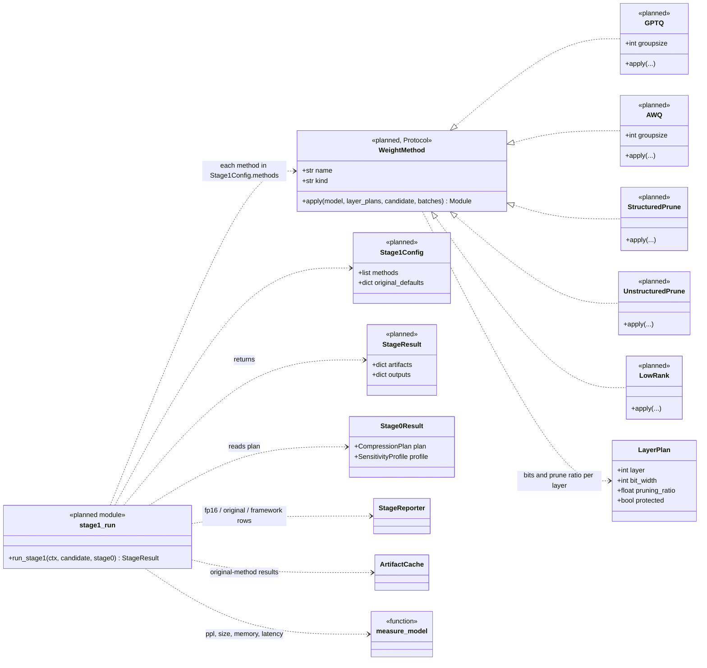
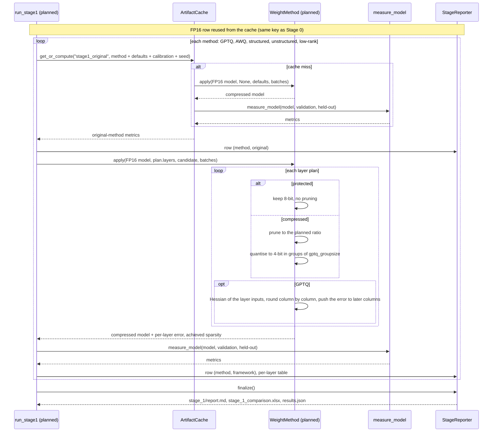

# Stage 1: weight compression (planned)

Not written yet. Drawn from the design (v2_1 diagram, "Stage 1" page) and the thesis spec; names are proposals.
Back to the [overview](README.md).

## In plain words

A model is billions of stored numbers ("weights"). Stage 1 makes that store smaller in two ways: keeping each
number with fewer bits (**quantisation**, like rounding prices to the nearest dollar), and throwing away numbers
that barely matter (**pruning**). The standard methods treat every layer the same. The framework follows the
Stage 0 plan instead: protected layers keep 8 bits and are not pruned, the rest get 4 bits and are pruned.

For each method (GPTQ, AWQ, structured, unstructured and low-rank pruning) Stage 1 builds the standard version
and the framework version, really compresses the model, and measures accuracy, size, memory and speed against
the uncompressed model.

## Class diagram

`layer_plans` is `None` for the original method (uniform method defaults) and the Stage 0 plan's layers for the
framework. `gptq_groupsize` comes from the search space. `StageResult` is meant to be shared by Stages 1 to 3.

## Sequence diagram

