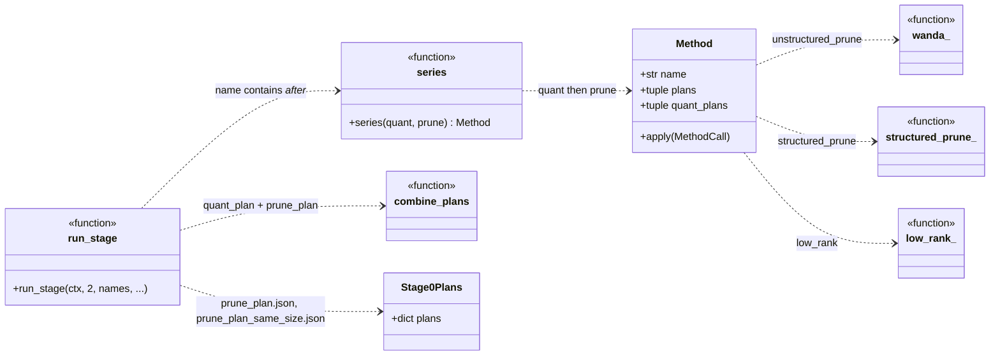
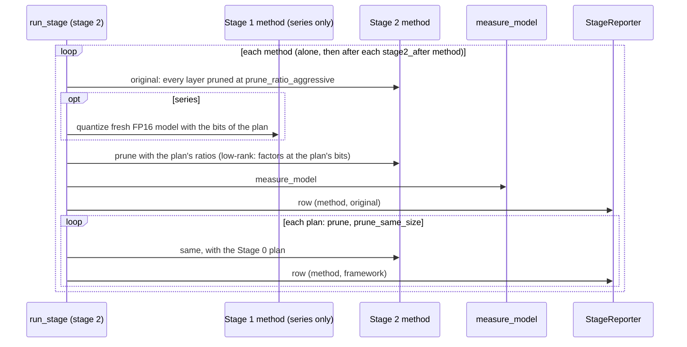

# Stage 2: pruning

Drawn from the code (`src/sdf/stages/pruning.py`, `methods.py`). Back to the [overview](README.md).

## In plain words

Stage 2 makes the model smaller by **removing** numbers that barely matter and rounds nothing: single weights
(**Wanda**), whole feed-forward channels (**structured pruning**), or the part of a weight table a smaller
**low-rank** copy can drop. The standard way removes the same share from every layer. The framework removes more
from the layers Stage 0 found robust and nothing from the fragile or never-pruned ones.

Two paths:

- Stage 0 > Stage 2 > Stage 4: prunes the uncompressed (FP16) model.
- Stage 0 > Stage 1 > Stage 2 > Stage 4: a Stage 1 method quantizes first, then the Stage 2 method prunes the
  quantized model (rows named `<pruning>_after_<quantization>`).

## Class diagram

## Sequence diagram

