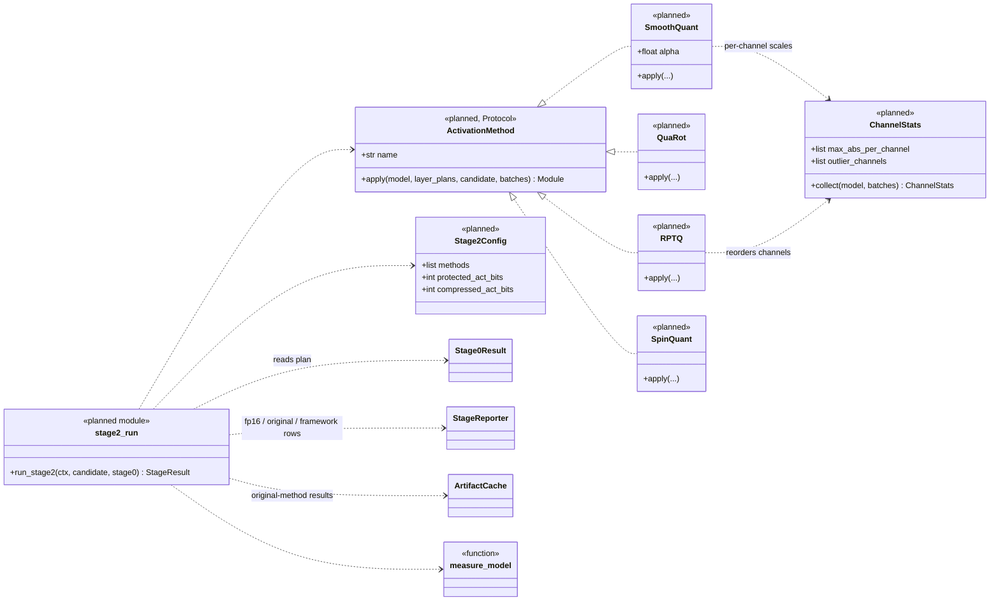
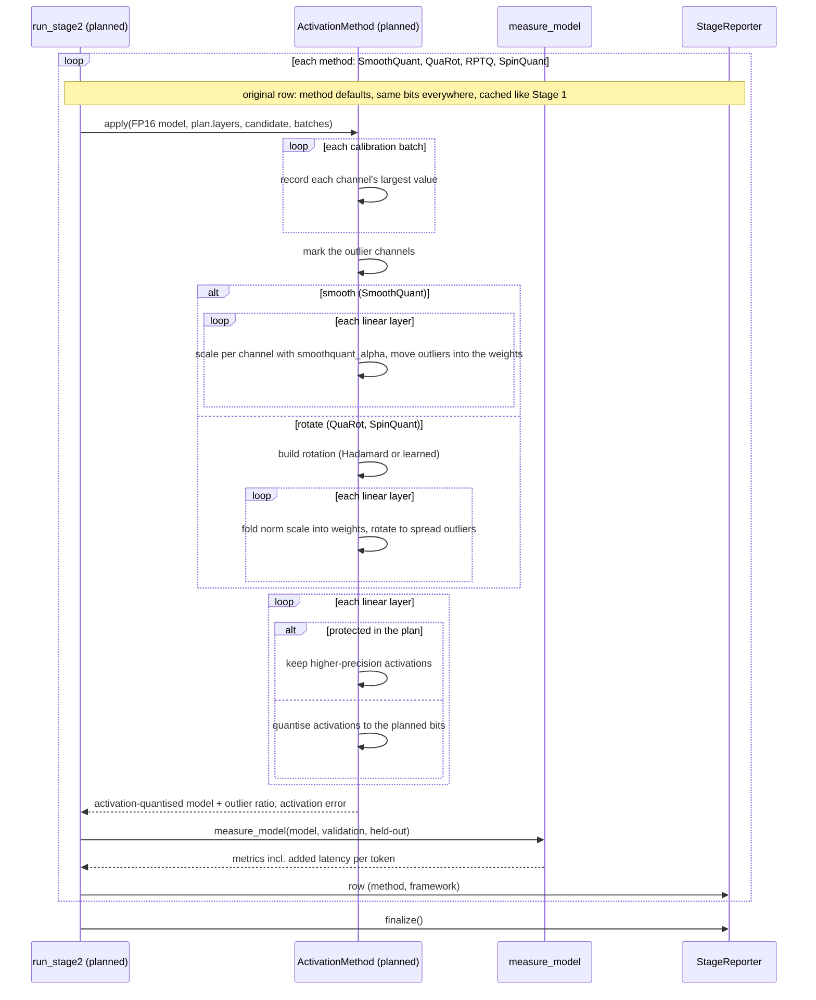

# Stage 2: activation compression (planned)

Not written yet. Drawn from the design (v2_1 diagram, "Stage 2" page) and the thesis spec; names are proposals.
Back to the [overview](README.md).

## In plain words

Besides its stored numbers, a model computes new numbers at every step while it runs ("activations"). Storing
those with fewer bits too makes the model faster, but a few of them are huge **outliers** that get ruined by
rounding. The methods here tame the outliers first: **SmoothQuant** moves part of the difficulty into the stored
weights (how much is set by the "migration strength", `smoothquant_alpha`), while **QuaRot**, **RPTQ** and
**SpinQuant** mix the numbers so the outliers are spread evenly. None of this changes the model's output before
rounding.

The framework version keeps activations at higher precision in the layers Stage 0 protected. Stage 2 starts
from the uncompressed model and the Stage 0 plan, not from Stage 1's output, so each stage's effect is measured
on its own.

## Class diagram

`smoothquant_alpha` joins `SEARCH_SPACE` when this stage is written.

## Sequence diagram

