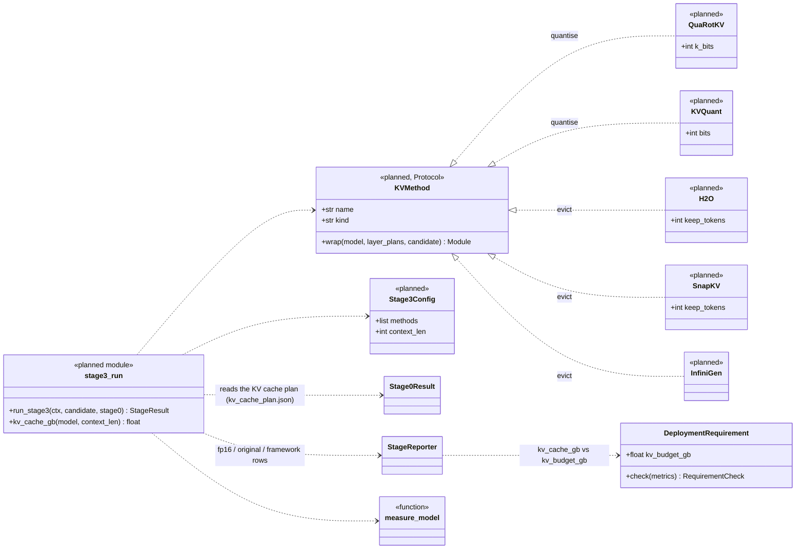
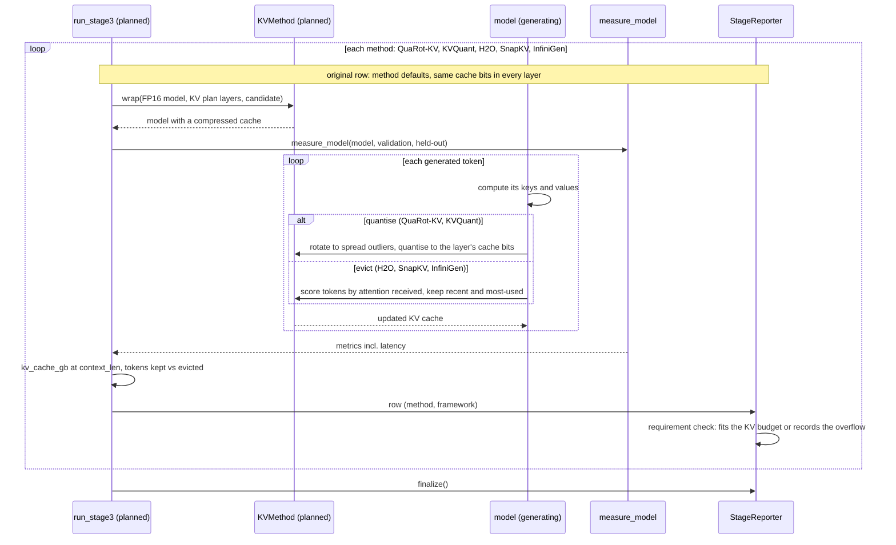

# Stage 3: KV-cache compression (planned)

Not written yet. Drawn from the design (v2_1 diagram, "Stage 3" page) and the thesis spec; names are proposals.
Back to the [overview](README.md).

## In plain words

While a model writes a reply, it keeps a short-term memory of everything said so far, called the **KV cache**.
For long conversations this memory can grow bigger than the model itself. Stage 3 shrinks it in two ways:
storing it with fewer bits (**QuaRot-KV**, **KVQuant**; the bit count is `quarot_k_bits`), or forgetting the
words the model pays least attention to (**H2O**, **SnapKV**, **InfiniGen**). It then checks whether the memory
fits the budget set in the deployment requirement.

The framework version follows Stage 0's KV cache plan: each layer's own key bits, value bits and token budget
(see [stage0.md](stage0.md)). Like Stage 2, it
starts from the uncompressed model and the Stage 0 plan.

## Class diagram

`quarot_k_bits` joins `SEARCH_SPACE` when this stage is written. `kv_cache_gb` is already in
`DeploymentRequirement`'s checks; its metric spec joins the registry when this stage first emits it.

## Sequence diagram

