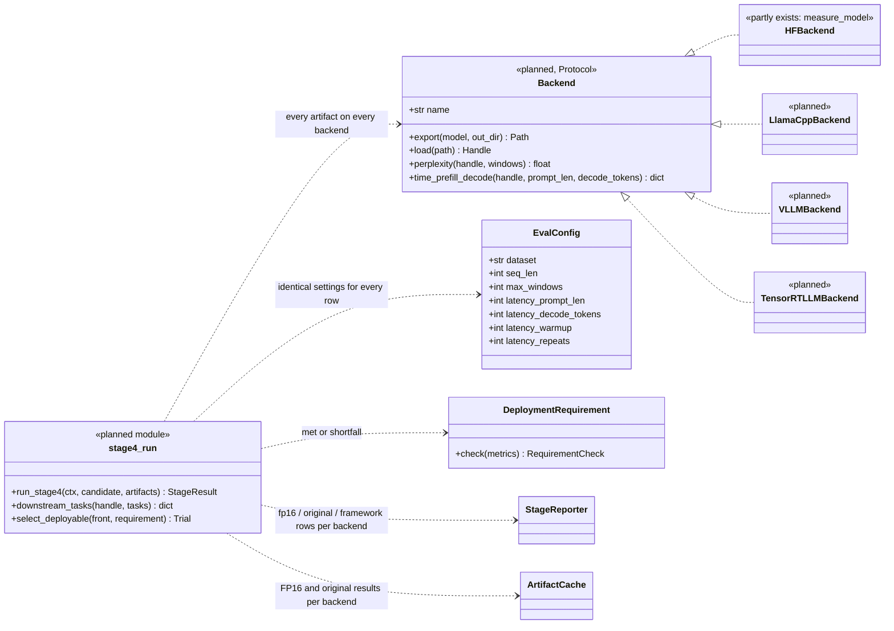
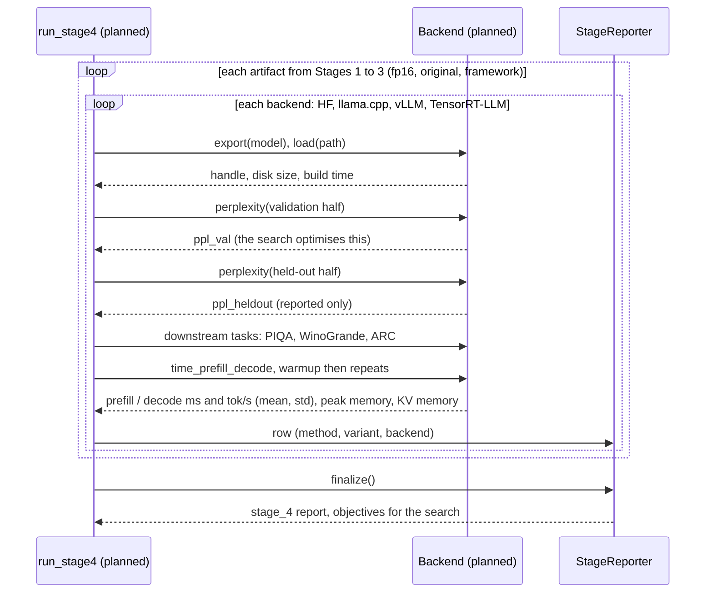
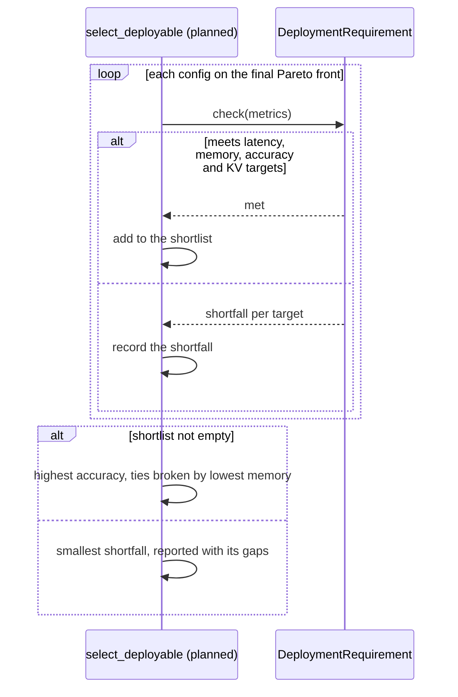

# Stage 4: evaluation across backends (planned)

Not written yet. Drawn from the design (v2_1 diagram, "Stage 4" page) and the thesis spec; names are proposals.
Back to the [overview](README.md).

Part of it exists: `eval.metrics.measure_model` already measures perplexity on both halves, model size, peak
memory and prefill / decode latency on HF Transformers, and every stage uses it.

## In plain words

A compressed model is only useful if it runs well on the software people actually use to serve models. Stage 4
loads each compressed model on four such programs (**HF Transformers**, **llama.cpp**, **vLLM**,
**TensorRT-LLM**) and measures, the same way every time: how accurate it is (prediction error on test text, plus
multiple-choice tests of common sense and reasoning), how much memory it needs, and how fast it reads a prompt
and writes a reply.

The test text is split in two. The search may look at the first half to pick settings; the second half is
never used for tuning and is the honest check. At the end of a search, Stage 4 also picks the final model: the
most accurate one that meets every deployment target, or the closest one with a note of how far it falls short.

## Class diagram

## Sequence diagram: evaluating one trial

## Sequence diagram: choosing the deployable model after the search

