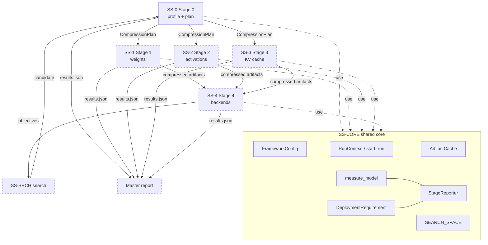
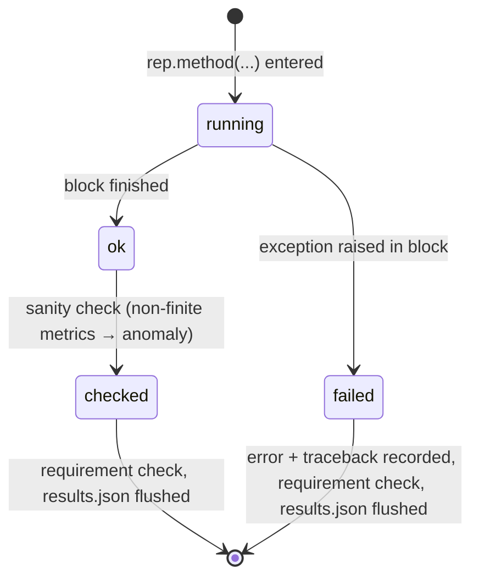

# Subsystem Design Description: Sensitivity-Driven Adaptive LLM Compression Framework

| | |
|---|---|
| Document | Software Design Description (SDD), subsystem level |
| Standard | IEEE 1016-2009; viewpoint vocabulary from ISO/IEC/IEEE 42010:2022 |
| System | Sensitivity-Driven Framework (`sdf`), MSc thesis codebase |
| Owner | Mohammad (GitHub `hamuutpls`) |
| Version | 0.1 (draft), 2026-09-29 |
| Status of design | SS-CORE and SS-0 implemented (branch `stage0-sensitivity`); SS-1 to SS-4 and SS-SRCH designed, not implemented |
| Requirements | [System Requirements Specification](system-requirements-specification.md) (ISO/IEC/IEEE 29148) |
| Diagrams | [`docs/diagrams/`](../diagrams/README.md) (Mermaid class and sequence diagrams) |

## Change history

| Version | Date | Change |
|---|---|---|
| 0.1 | 2026-09-29 | First draft. Implemented parts described from the code; planned parts from the thesis spec, the v2_1 diagram and `docs/diagrams/`. |

---

## 1. Introduction

### 1.1 Purpose

This document describes how the framework is built: which subsystems it has, what each one is responsible for,
what it takes in and hands on, how it behaves, and why it was designed that way. Each requirement in the SyRS
traces to a section here (Appendix A).

### 1.2 Scope

All seven subsystems: the shared core, Stages 0 to 4, and the search layer. For subsystems that are not yet
written, the design is a proposal; class and function names are marked *(planned)* and may change when the
stage is implemented. The CHANGELOG records when a planned design becomes code.

### 1.3 How to read this document

Every subsystem section uses the same headings, one per IEEE 1016 viewpoint (§2.3): purpose, composition,
interfaces, information, interaction, algorithm, state, resources, errors, rationale. A heading is left out
when it has nothing to say for that subsystem.

*In plain words:* think of the framework as a small factory. The shared core is the office (settings, record
keeping, the measuring bench). Stage 0 is the inspection desk that decides how hard each part can be squeezed.
Stages 1 to 3 are three separate machines that each squeeze a different kind of material. Stage 4 is the test
track. The search is the manager who tries different machine settings and keeps the best trade-offs. Each
section below describes one of those rooms.

### 1.4 Conventions

- `code` names refer to the Python package `sdf` under `src/sdf/`.
- **(planned)** marks designed but unwritten parts.
- Requirement IDs (e.g. `S0-04`) refer to the SyRS.

---

## 2. Stakeholders, concerns and viewpoints

### 2.1 Stakeholders

| Stakeholder | Role |
|---|---|
| Researcher | Builds and runs the framework; writes the thesis. |
| Supervisor / examiner | Judges whether the comparisons are fair and the results reproducible. |
| Non-specialist reader | Reads the reports and the thesis summary. |
| Future maintainer | Adds a stage, a method or a search parameter. |

### 2.2 Design concerns

| # | Concern | Raised by |
|---|---|---|
| C1 | Are comparisons fair (identical conditions, size-matched where needed)? | Examiner |
| C2 | Can every number be traced to its configuration and reproduced? | Examiner, researcher |
| C3 | Can the held-out data leak into tuning? | Examiner |
| C4 | Does a Colab disconnect or one broken method lose work? | Researcher |
| C5 | How much does a new stage, method or parameter cost to add? | Maintainer |
| C6 | Does it fit in 16 GB of GPU memory, and how long does a trial take? | Researcher |
| C7 | Can a non-specialist understand the results? | Non-specialist reader |

### 2.3 Viewpoints used (IEEE 1016 clause 5)

| Viewpoint (1016 §) | Answers | Concerns | Where |
|---|---|---|---|
| Context (5.2) | What is inside and outside the system | C2 | §3.1 |
| Composition (5.3) | Which subsystems and modules exist | C5 | §3.2, each subsystem |
| Logical (5.4) | Classes and their relations | C5 | [`docs/diagrams/`](../diagrams/README.md) |
| Dependency (5.5) | Who uses whom; build order | C5 | §3.3 |
| Information (5.6) | Files, cache entries, data formats | C2, C4 | §3.5, each subsystem |
| Interface (5.9) | Function signatures and contracts | C5 | each subsystem |
| Interaction (5.11) | Order of calls at run time | C1, C3 | §3.4 and sequence diagrams |
| State dynamics (5.10) | Row, run and search states | C4 | §4.3, §10 |
| Algorithm (5.12) | Scoring, planning, cost model, search | C1, C3 | each subsystem |
| Resource (5.13) | GPU memory, time | C6 | each subsystem |
| Patterns (5.8) | Reused design patterns | C5 | §3.6 |

Not used: *Structure* (5.7) is covered by composition and logical; *Interface* at the user level is only the CLI
(§4.1).

---

## 3. Architecture (whole system)

### 3.1 Context view

See the context diagram in [SyRS §1.3.1](system-requirements-specification.md#131-system-context). The system
reads a model and datasets from the Hugging Face Hub, reads and writes a cache folder, writes results to a
results folder (Google Drive on Colab), and (planned) drives four inference backends.

### 3.2 Composition view: subsystems

| ID | Subsystem | Modules | Status | Requirements |
|---|---|---|---|---|
| SS-CORE | Shared core: configuration, run setup, measurement, reporting, cache, deployment requirement | `config.py`, `run.py`, `cli.py`, `data.py`, `requirements.py`, `search_space.py`, `eval/metrics.py`, `reporting/`, `utils/` | Implemented (master report planned) | CFG-*, CMP-*, MET-*, REP-*, USE-* |
| SS-0 | Stage 0: sensitivity profiling and planning | `stage0/sensitivity.py`, `stage0/planner.py`, `stage0/run.py` | Implemented | S0-*, PIPE-03 |
| SS-1 | Stage 1: weight compression | `stage1/` *(planned)* | Planned | S1-* |
| SS-2 | Stage 2: activation compression | `stage2/` *(planned)* | Planned | S2-* |
| SS-3 | Stage 3: KV-cache compression | `stage3/` *(planned)* | Planned | S3-*, MET-06 |
| SS-4 | Stage 4: evaluation across backends | `stage4/` *(planned)*; HF measurement in `eval/metrics.py` today | Partial | S4-*, MET-03 |
| SS-SRCH | Search layer | `search/` *(planned)*; `search_space.py` today | Partial | SRCH-* |



Dashed boxes are planned.

### 3.3 Dependency view

- Every stage depends on SS-CORE; SS-CORE depends on no stage (reporting and measurement know nothing about
  any particular method).
- Stages 1, 2 and 3 depend on SS-0's `CompressionPlan` and **not on each other** (PIPE-02). Each starts from the
  uncompressed model plus the plan, so each stage's effect is measured on its own.
- SS-4 depends on the artifacts of Stages 1 to 3. SS-SRCH depends on all stages through one objective function.
- Build order: SS-CORE → SS-0 → SS-1 → SS-2 and SS-3 (in either order) → SS-4 → SS-SRCH → master report.

### 3.4 Interaction view: a full run

The full-run sequence (search loop, then full comparisons on the final candidates, then the master report) is
drawn in [`docs/diagrams/README.md`](../diagrams/README.md#sequence-diagram-the-full-run-planned). In short:

1. Load the configuration and start the run (§4.1, §4.2).
2. For each searcher, until its trial budget is used: ask for a candidate, run Stage 0 (cached profile, new
   plan), run Stages 1 to 3 on that plan, evaluate on Stage 4, tell the searcher the objectives (§10).
3. Take each searcher's Pareto front and the best configuration per objective.
4. For those configurations only, run the full three-variant comparison in every stage (SRCH-07).
5. Write the master report (§4.7).

### 3.5 Information view: run folder

```
<output_root>/<run_id>/
  config.json                    resolved configuration snapshot (CFG-03)
  run.log                        timestamped log (CFG-07)
  stage_0/                       report.md, stage_0_comparison.xlsx, results.json,
                                 compression_plan*.json, sensitivity_profile.json
  stage_1/ … stage_4/            report.md, stage_<N>_comparison.xlsx, results.json       (planned)
  search/                        search_report.md, search_results.xlsx, *.png             (planned)
  all_stages_comparison.xlsx     master workbook                                          (planned)
  master_report.md               master report                                            (planned)
<cache_dir>/
  <kind>/<hash>.json             {"key": {...}, "value": {...}}  (INF-01)
```

### 3.6 Patterns

| Pattern | Where | Why |
|---|---|---|
| Single configuration object | `FrameworkConfig` | One source of truth; snapshot and hash make runs reproducible (C2). |
| Strategy | `WeightMethod`, `ActivationMethod`, `KVMethod`, `Backend`, `Searcher` *(planned)* | A new method is one new class; the stage runner does not change (C5). |
| Context manager for fault isolation | `StageReporter.method()` | A failing method becomes a failed row, not a crashed stage (C4). |
| Memoisation keyed by inputs | `ArtifactCache.get_or_compute` | Expensive results reused whenever their inputs are unchanged (C6). |
| Ask / tell | `Searcher` *(planned)* | The same trial loop drives Optuna, successive halving and pymoo. |

---

## 4. SS-CORE: shared core

**Purpose.** Everything every stage needs and nothing stage-specific: configuration, run setup, data splits,
measurement, requirement checks, caching and reporting. **Status:** implemented, except the master report.

### 4.1 Configuration (`config.py`, `search_space.py`, `cli.py`)

**Composition.** `FrameworkConfig` holds `RunConfig`, `ModelConfig`, `DataConfig`, `CalibrationConfig`,
`EvalConfig`, `Stage0Config`, `DeploymentRequirement` and `hyperparams`. Each future stage adds one
`StageNConfig` block (MNT-04). Every default and its explanation live in `config.py`; the YAML only carries
what differs (for example Colab paths).

**Interfaces.**

| Function | Contract |
|---|---|
| `load_config(path=None, overrides=None) -> FrameworkConfig` | Defaults, then YAML, then dotted-key overrides. Unknown keys raise `KeyError` naming the key (CFG-02). |
| `FrameworkConfig.with_overrides({"eval.seq_len": 256})` | Returns a new object; the original is untouched. |
| `config_hash(*parts, length=12) -> str` | SHA-256 of sorted JSON; used for run ids and cache keys. |
| `SEARCH_SPACE.make(overrides) -> dict` | Defaults plus overrides, validated against each `Param`'s range or choices. |
| `sdf-stage0 --config <yaml> --set key=value ...` | CLI; `--set` values parsed as YAML. |

**Information.** A *candidate* is a plain `dict` of search-parameter name to value. Search parameters are
`Param(name, stage, default, low/high or choices)`; the `stage` field records which stage consumes each one.

| Parameter | Stage | Range / choices | Default | Status |
|---|---|---|---|---|
| `sensitive_threshold` | 0 | 0.1 – 0.9 | 0.5 | Implemented |
| `prune_ratio_aggressive` | 0 | 0.0 – 0.6 | 0.3 | Implemented |
| `calib_dataset` | 0 | wikitext2, c4, pile10k | wikitext2 | Implemented |
| `calib_samples` | 0 | 16, 32, 64, 128 | 64 | Implemented |
| `gptq_groupsize` | 1 | 32, 64, 128, per-channel (−1) | 128 | Implemented (space); used by Stage 0's memory prediction |
| `smoothquant_alpha` | 2 | 0.0 – 1.0 *(proposed)* | 0.5 *(proposed)* | Planned |
| `quarot_k_bits` | 3 | 2, 3, 4, 8 *(proposed)* | 4 *(proposed)* | Planned |

**Rationale.** A candidate is kept separate from `FrameworkConfig` so the search can generate thousands of
candidates without copying the whole configuration, and so the cache key of an artifact can include exactly the
candidate fields it depends on.

### 4.2 Run setup (`run.py`, `utils/`)

**Interface.** `start_run(cfg) -> RunContext(cfg, run_id, run_dir, cache)`: creates `<output_root>/<run_id>/`,
writes `config.json`, starts console and file logging, fixes seeds (`set_seed(seed, deterministic)`, with
`torch.use_deterministic_algorithms` in warn-only mode), and opens the cache. `environment_info()` returns
Python, platform, package versions, GPU and CUDA for every report (CFG-08).

**State.** A run is *new* when its folder does not exist and *resumed* otherwise; resumed runs reuse the cache
and overwrite stage outputs row by row (CFG-06).

**Rationale.** `run_id = timestamp + config hash` means two runs with different settings never share a folder
by accident, and the hash alone tells whether two runs had identical settings.

### 4.3 Reporting (`reporting/reporter.py`, `markdown.py`, `excel.py`, `metrics.py`)

**Purpose.** The one reporter every stage uses (REP-01).

**Interfaces.**

| Member | Contract |
|---|---|
| `StageReporter(stage, run_dir, title, config, environment, conditions, requirement, main_metrics)` | Creates `run_dir/stage_<N>/`. `conditions` is the dict of identical conditions printed in every report (CMP-02). |
| `with rep.method(method, variant, **info) as row:` | Adds a row; the stage fills `row.metrics`. `variant` must be `fp16`, `original` or `framework`. |
| `rep.add_raw(method, variant, records)` | Raw measurements for the Raw sheet (INF-02). |
| `rep.per_layer`, `rep.findings`, `rep.next_steps`, `rep.sections`, `rep.glossary`, `rep.plain_*` | Stage-specific content; the plain-language fields feed the non-specialist part of `report.md` (REP-06). |
| `rep.finalize() -> {"report": Path, "xlsx": Path, "json": Path}` | Computes deltas, writes the three files. |

**State dynamics of a row.**



**Algorithm: deltas (CMP-03).** For every numeric metric of every row: `abs = value − ref` and
`pct = 100 · (value − ref) / ref` with `ref` the fp16 row and, separately, the same method's original row
(`info["compare_to"]` can point a row at another method's original, e.g. the same-size plan at the uniform
plan). Whether a delta is a win uses each metric's direction in `reporting/metrics.py` (`lower` or `higher`
is better); the Summary sheet colours wins and losses against the original (REP-03).

**Information.** `results.json` = config, environment, conditions, requirement, rows (metrics, deltas,
requirement check, status, error), per-layer table, raw records, findings, anomalies, next steps. The xlsx has
Summary, Config, Per-layer, Raw and Charts sheets. All text is written UTF-8 through `atomic_write_text`
(temp file + rename) (REP-05, REP-08).

**Errors.** Exceptions inside a row are caught deliberately (broad `except Exception`), recorded, and the stage
continues (CMP-06). Exceptions outside a row (e.g. the model cannot load) stop the stage, since no row could be
meaningful.

**Rationale.** A context manager puts error capture, timing of the flush and the requirement check in one
place, so a stage author cannot forget them. Writing `results.json` after every row bounds the loss from a
Colab disconnect to one row (C4).

**Open item.** MET-09's "memory decreased versus fp16" check is to be added to `_sanity_check`.

### 4.4 Deployment requirement (`requirements.py`)

**Interface.** `DeploymentRequirement(target_latency_ms, target_memory_gb, target_ppl, kv_budget_gb,
hardware_profile).check(metrics) -> RequirementCheck(met, shortfall, checked, unmeasured)`.

**Algorithm.** Each target is an upper bound checked against the first available metric in a preference list:

| Target | Metric(s), in order |
|---|---|
| `target_latency_ms` | `decode_ms_per_token_mean` |
| `target_memory_gb` | `model_size_gb`, then `predicted_weight_memory_gb` |
| `target_ppl` | `ppl_val` (never held-out, MET-02) |
| `kv_budget_gb` | `kv_cache_gb` |

`met` is `False` if any target is exceeded (with `shortfall = value − target`), `None` if nothing failed but a
target could not be measured yet (e.g. latency of a Stage 0 plan), otherwise `True`.

**Rationale.** A three-valued `met` stops a plan that has only *predicted* numbers from being reported as
meeting a latency target it was never measured against.

### 4.5 Cache (`utils/cache.py`)

**Interface.** `ArtifactCache(root).get_or_compute(kind, key, compute) -> (value, was_cached)`.

**Information.** One JSON file per entry at `<root>/<kind>/<config_hash(key)>.json`, holding both key and value
(INF-01). Current kinds: `sensitivity_profile` (key: model, profile dtype, calibration dataset, samples, seq_len,
batch size, seed) and `fp16_baseline` (key: model, dtype, eval settings, GPU name, backend, seed). Planned kinds: `original_<stage>_<method>`
for each stage's original variant (CMP-05).

**Errors.** A corrupt entry is logged and recomputed.

### 4.6 Data and measurement (`data.py`, `eval/metrics.py`)

**Algorithm: evaluation split (MET-01, MET-02).** The WikiText-2 raw test split is joined with blank lines,
tokenised once, and cut into `n` non-overlapping windows of `eval.seq_len` tokens (optionally capped at
`max_windows`). Windows `0 … n/2 − 1` are the **validation** half, the rest the **held-out** half. The split is
contiguous and deterministic, so every row of every stage sees identical windows.

**Algorithm: calibration windows.** Documents of the calibration dataset are shuffled with the run seed and
tokenised into one stream until it holds four times the tokens needed; `calib_samples` window starts are drawn
with the same seed.

**Interface.** `measure_model(model, validation, held_out, eval_cfg, device, seed) -> (metrics, raw)`.

| Metric | How |
|---|---|
| `ppl_val`, `ppl_heldout` | `exp(mean per-window NLL)`; non-finite raises `FloatingPointError`. |
| `model_size_gb` | Bytes of all parameters and buffers, tied tensors counted once (the safetensors payload). |
| `peak_memory_gb` | `torch.cuda.max_memory_allocated` after a reset (GPU only). |
| `prefill_ms_*`, `decode_ms_per_token_*`, tokens/s | Random prompt of `latency_prompt_len` tokens, then `latency_decode_tokens` greedy steps with the KV cache; `latency_warmup` untimed runs, then `latency_repeats` timed runs; mean and standard deviation; every repeat kept as a raw record (MET-07). CUDA is synchronised around each timing. |
| `build_time_s` | Wall-clock of everything needed to produce the variant, including profiling (MET-08). |

**Rationale.** A contiguous split (rather than random) means the held-out half is text the search never saw
in any window, and the split never changes between runs.

### 4.7 Master report *(planned)*

**Purpose.** After a full run, read every `stage_<N>/results.json` and `search/` output and write
`all_stages_comparison.xlsx` (one Summary sheet per stage plus a cross-stage summary) and `master_report.md`
(plain-language overview first, then the tables) (REP-07). **Interface** *(proposed)*:
`MasterReport.write(run_dir) -> dict[str, Path]`. **Rationale.** Reading the per-stage JSON rather than holding
objects in memory means the master report can be rebuilt at any time, even after a disconnect.

---

## 5. SS-0: Stage 0, sensitivity profiling and planning

### 5.1 Purpose and status

Measure how fragile each decoder layer is and turn that into a per-layer plan of bit widths and pruning ratios,
which Stages 1 to 3 follow. Also predict what the plan costs before anything is compressed. **Status:**
implemented and tested. Diagrams: [`stage0.md`](../diagrams/stage0.md).

*In plain words:* Stage 0 nudges each layer a tiny bit and watches how much the model's mistakes grow. Layers
where mistakes grow a lot are marked "protect"; the rest are marked "compress hard".

### 5.2 Composition and interfaces

| Module | Main members |
|---|---|
| `stage0/sensitivity.py` | `SensitivityProfile`, `profile_sensitivity(model, batches, device, meta)`, `normalize(scores, method)`, `outlier_layers(raw, cutoff=3.5)`, `find_decoder_layers`, `layer_shapes` |
| `stage0/planner.py` | `LayerPlan`, `CompressionPlan`, `plan_compression(...)`, `uniform_plan(...)`, `budget_matched_plan(...)`, `PlanCost`, `predict_cost(...)`, `baseline_cost(...)` |
| `stage0/run.py` | `run_stage0(ctx, candidate, model=None, tokenizer=None, text_loader=None, measure_fp16=True) -> Stage0Result(plan, profile, outputs)` |

**Contract handed to later stages (PIPE-03).** `CompressionPlan` JSON:

```json
{"kind": "sensitivity", "sensitive_threshold": 0.5, "prune_ratio_aggressive": 0.3,
 "layers": [{"layer": 0, "bit_width": 4, "pruning_ratio": 0.3, "protected": false, "sensitivity": 0.0}, ...]}
```

`kind` is `sensitivity` (threshold plan), `budget` (size-matched plan) or `uniform` (original variant).

### 5.3 Algorithm: sensitivity score (S0-01 to S0-03)

For decoder layer *l*, over calibration batches *b*:

    s_l = Σ_b Σ_{w ∈ layer l} |∂L/∂w · w|

the first-order Taylor estimate of the loss change if the layer's weights were zeroed. Only decoder-layer
parameters get gradients (embeddings and LM head are frozen for the pass and their flags restored afterwards).
Profiling runs in `stage0.profile_dtype` (float32 by default, since float16 gradients overflow).

Normalisation to [0, 1]:

- **rank** (default): `rank(s_l) / (n − 1)`, ties averaged. A threshold *t* then protects about the top
  (1 − *t*) share of layers on any model.
- **minmax**: `(s_l − min) / (max − min)`.

Outliers are flagged when `|s − median| / (1.4826 · MAD) > 3.5` (Iglewicz and Hoaglin).

**Rationale.** Rank was chosen after the first TinyLlama run: layer 0 scores 2705 against 6596–8647 for the
others, so min-max squeezed layers 1–21 into 0.66–1.0 and threshold 0.5 protected 21 of 22 layers.

### 5.4 Algorithm: planning and cost model (S0-04 to S0-07, CMP-07)

**Threshold plan.** `s_l ≥ sensitive_threshold` → protected (`protected_bits` = 8, no pruning); otherwise
compressed (`compressed_bits` = 4, pruned at `prune_ratio_aggressive`).

**Original variant.** Uniform: every layer `uniform_bits` = 4, pruning `uniform_prune_ratio` = 0.

**Size-matched plans.** Rank layers by sensitivity; protect the top *k* for the largest *k* whose predicted
memory fits the uniform plan's. Two versions: with pruning (robust layers 4-bit, pruned) and without pruning
(robust layers `no_prune_compressed_bits` = 3, nothing removed), the second isolating the effect of the
guidance from the effect of pruning.

**Cost model (`predict_cost`).** Per decoder layer: `kept = numel · (1 − prune)`; `bits = kept · bit_width`,
plus `group_overhead_bits` (32: one scale and zero point) per quantisation group of `gptq_groupsize` weights
(or per output channel). Everything outside the decoder Linear weights stays at `baseline_bits` (16). Reported:
weight memory (GB), average bits per weight, sparsity, and

    sensitivity exposure = Σ_l s_l · (1 − b_l · (1 − p_l) / 16) / Σ_l s_l

the share of compression that lands on sensitive layers (lower is better).

**Rows reported.** fp16 (measured once, cached); original (uniform); framework (threshold plan); framework,
same size; framework, same size without pruning. Plan rows carry *predicted* metrics; accuracy and latency of
plans are measured once Stage 1 applies them.

### 5.5 Information

Outputs in `stage_0/`: `report.md`, `stage_0_comparison.xlsx`, `results.json`, `compression_plan.json`,
`compression_plan_budget_matched*.json`, `sensitivity_profile.json`. The profile is cached under
`sensitivity_profile/` keyed by model and calibration settings only, so a trial that changes
`sensitive_threshold` or `prune_ratio_aggressive` re-plans in milliseconds (S0-08, PERF-02). Normalisation is
applied after the cache, so changing it reuses the profile.

### 5.6 Errors

Non-finite scores raise `FloatingPointError` naming `stage0.profile_dtype` (S0-09). A pruning ratio outside
[0, 1) raises `ValueError`. A size budget that even *k* = 0 exceeds returns the *k* = 0 plan and the report
flags it. Leftover budget after packing (e.g. 0.011 GB on TinyLlama) is stated in the report.

### 5.7 Resources

Profiling TinyLlama in float32 needs about 9 GB (weights + gradients of decoder layers); bfloat16 halves it
(PERF-01). Time scales with `calib_samples × seq_len`.

---

## 6. SS-1: Stage 1, weight compression *(planned)*

### 6.1 Purpose

Really compress the stored weights, following the Stage 0 plan in the framework variant, and measure the
result (S1-01 to S1-04). Diagrams: [`stage1.md`](../diagrams/stage1.md).

*In plain words:* store each number with fewer digits (quantisation) and throw away the numbers that matter
least (pruning), gently in protected layers and hard elsewhere.

### 6.2 Composition and interfaces *(proposed)*

| Member | Contract |
|---|---|
| `WeightMethod` (strategy) | `name`, `kind` (`quantise` / `prune` / `low_rank`), `apply(model, layer_plans, candidate, batches) -> nn.Module`. |
| `GPTQ`, `AWQ` | Quantise each layer to `layer_plans[l].bit_width` with group size `candidate["gptq_groupsize"]`. |
| `StructuredPrune`, `UnstructuredPrune` | Remove `pruning_ratio` of each layer's channels / weights. |
| `LowRank` | Replace each Linear weight with a rank-*r* factorisation, *r* chosen so the layer's size matches its planned bits. |
| `Stage1Config` | `methods`, `original_defaults` per method (e.g. GPTQ 4-bit, group 128). |
| `run_stage1(ctx, candidate, stage0) -> StageResult(artifacts, outputs)` | fp16 row (from cache), original row per method (from cache when possible), framework row per method. |

### 6.3 Interaction

For each method: original = `apply(model, uniform layer plans from Stage1Config.original_defaults)`;
framework = `apply(model, stage0.plan.layers)`; each followed by `measure_model` and a reporter row. The
compressed model is saved as an artifact for Stage 4.

### 6.4 Algorithm notes

- GPTQ per layer: collect the layer-input Hessian `H = 2XXᵀ` from calibration batches, quantise column by column,
  and spread each column's rounding error over the remaining columns using `H⁻¹`.
- AWQ: scale salient input channels (by activation magnitude) before quantising, search the scale per layer.
- Pruning before quantisation in compressed layers, so the quantiser sees the final weights.
- Report predicted (Stage 0) vs measured size per layer, closing the loop on the cost model (S1-04).

### 6.5 Resources and rationale

GPTQ on TinyLlama processes one decoder layer at a time, so peak memory stays near one layer's Hessians plus the
model. **Rationale:** a strategy interface keeps the runner identical for five methods and makes each method
testable alone on a tiny random Llama.

---

## 7. SS-2: Stage 2, activation compression *(planned)*

### 7.1 Purpose

Quantise the activations (the numbers the model computes while running) and handle their outliers, keeping
higher activation precision in layers Stage 0 protected (S2-01 to S2-03). Starts from the uncompressed model
and the plan, not from Stage 1's output (PIPE-02). Diagrams: [`stage2.md`](../diagrams/stage2.md).

### 7.2 Composition and interfaces *(proposed)*

| Member | Contract |
|---|---|
| `ActivationMethod` | `name`, `apply(model, layer_plans, candidate, batches) -> nn.Module`. |
| `SmoothQuant` | Migrates difficulty from activations to weights with `s_j = max|X_j|^α / max|W_j|^(1−α)`, `α = candidate["smoothquant_alpha"]`. |
| `QuaRot`, `SpinQuant` | Rotate hidden states with a Hadamard (QuaRot) or learned (SpinQuant) orthogonal matrix, folded into the weights, so outliers spread evenly. |
| `RPTQ` | Cluster and reorder channels by range, quantise each cluster with its own scale. |
| `ChannelStats` | `collect(model, batches)`: per-channel max-abs and outlier channels. |
| `Stage2Config` | `methods`, `protected_act_bits` *(proposed 8)*, `compressed_act_bits` *(proposed 4)*. |
| `run_stage2(ctx, candidate, stage0) -> StageResult` | Same three-variant protocol as Stage 1. |

### 7.3 Mapping the plan (open issue SyRS §5.2 #3)

Proposed: a layer protected in the plan gets `protected_act_bits` for its input activations, others get
`compressed_act_bits`. The rotation or smoothing transform itself is applied to every layer, since it does not
change the output before rounding.

### 7.4 Rationale

Keeping Stage 2 independent of Stage 1 means its effect can be attributed to activation compression alone;
combining stages is a Stage 4 question.

---

## 8. SS-3: Stage 3, KV-cache compression *(planned)*

### 8.1 Purpose

Shrink the KV cache by quantising it (QuaRot-KV, KVQuant) or evicting tokens (H2O, SnapKV, InfiniGen), giving
more cache precision or retention to protected layers; measure KV memory and check it against `kv_budget_gb`
(S3-01 to S3-04, MET-06). Diagrams: [`stage3.md`](../diagrams/stage3.md).

### 8.2 Composition and interfaces *(proposed)*

| Member | Contract |
|---|---|
| `KVMethod` | `name`, `kind` (`quantise` / `evict`), `wrap(model, layer_plans, candidate) -> nn.Module` (replaces the cache object used in generation). |
| `QuaRotKV` | Rotated keys/values quantised to `candidate["quarot_k_bits"]` in compressed layers, higher in protected layers. |
| `KVQuant` | Per-channel key quantisation before RoPE, per-token value quantisation, dense-and-sparse outliers. |
| `H2O`, `SnapKV`, `InfiniGen` | Keep recent tokens plus the tokens with the most accumulated attention; keep budget larger in protected layers. |
| `Stage3Config` | `methods`, `context_len` for the KV measurement. |
| `kv_cache_gb(model, context_len) -> float` | `2 · n_layers · n_kv_heads · head_dim · context_len · bits / 8` summed per layer with each layer's bits and kept-token share. |

### 8.3 Rationale

The cache is wrapped rather than the model rewritten, so the same model object serves the original and framework
variants and the HF generation loop is unchanged.

---

## 9. SS-4: Stage 4, evaluation across backends *(planned; HF measurement exists)*

### 9.1 Purpose

Load each compressed artifact on HF Transformers, llama.cpp, vLLM and TensorRT-LLM; measure the same metrics
under the same `EvalConfig` on each; add downstream tasks; and after a search, select the deployable model
(S4-01 to S4-03, MET-03). Diagrams: [`stage4.md`](../diagrams/stage4.md).

### 9.2 Composition and interfaces *(proposed)*

| Member | Contract |
|---|---|
| `Backend` | `name`, `export(model, out_dir) -> Path`, `load(path) -> Handle`, `perplexity(handle, windows) -> float`, `time_prefill_decode(handle, prompt_len, decode_tokens) -> dict`. |
| `HFBackend` | Wraps today's `measure_model`. |
| `LlamaCppBackend`, `VLLMBackend`, `TensorRTLLMBackend` | Export to each backend's format (GGUF, HF/AWQ/GPTQ checkpoints, TensorRT engine). |
| `run_stage4(ctx, candidate, artifacts) -> StageResult` | One row per (artifact, variant, backend); `conditions` records the backend. |
| `downstream_tasks(handle, tasks) -> dict` | Multiple-choice accuracy on a task suite *(to be chosen; SyRS open issue #1)*. |
| `select_deployable(front, requirement) -> Trial` | Highest validation accuracy among front members meeting every target, ties broken by lower memory; if none meets them, the smallest total shortfall, reported with its gaps. |

### 9.3 Errors

A backend that cannot load a format (e.g. an unstructured-sparse checkpoint on llama.cpp) produces a `failed`
row with the reason, through the same `rep.method()` mechanism (S4-03).

### 9.4 Rationale

Selection uses validation perplexity; held-out perplexity is shown next to it but never ranks (MET-02).

---

## 10. SS-SRCH: search layer *(planned; search space exists)*

### 10.1 Purpose

Find hyperparameters that give the best trade-offs between validation perplexity, memory, latency and build
cost, with three searchers run separately on the same space and budget, then benchmark the searchers
(SRCH-01 to SRCH-08). Diagrams: [`search.md`](../diagrams/search.md).

### 10.2 Composition and interfaces *(proposed)*

| Member | Contract |
|---|---|
| `SearchSpace` / `Param` | Implemented (§4.1). |
| `Searcher` | `name`, `ask() -> Proposal(candidate, fidelity)`, `tell(proposal, objectives)`. |
| `MOBOSearcher` | Optuna study with a multi-objective sampler (e.g. `TPESampler` or `MOTPE`), four minimised objectives. |
| `MFBOSearcher` | Successive halving: a rung of many candidates at low fidelity, keep the best fraction by non-dominated rank, re-evaluate at higher fidelity. |
| `NSGA3Searcher` | pymoo `NSGA3` with Das-Dennis reference directions for four objectives, driven in ask/tell mode. |
| `Trial` | `searcher, number, candidate, fidelity, objectives, ppl_heldout, requirement, wall_clock_s`. |
| `SearchRun(budget).run(searchers) -> list[Trial]` | Same budget per searcher; results not pooled. |
| `SearchRun.objective(candidate, fidelity) -> dict` | Stage 0 (cached profile) → Stages 1–3 → Stage 4 on HF; returns the four objectives, and `ppl_heldout` separately. |
| `SearchReport.write(trials, out_dir)` | `search_report.md`, `search_results.xlsx` (Trials, Pareto, Searcher comparison, Best configs), Pareto plots, hypervolume-over-trials plot. |

### 10.3 Algorithm: objectives and leakage guard (SRCH-03, MET-02)

Objectives, all minimised: `ppl_val`, memory (`model_size_gb`, or predicted weight memory at low fidelity),
`decode_ms_per_token_mean`, `build_time_s`. `ppl_heldout` is stored on the `Trial` but is not a field of the
objectives dict passed to `tell`, so no searcher can see it. A unit test *(planned)* asserts that `tell` never
receives a key containing `heldout`.

**Fidelity (MFBO).** Proposed fidelity levels: fraction of validation windows and of calibration samples;
full fidelity = the whole validation half. Only full-fidelity trials enter the final Pareto front
(SyRS open issue #4).

### 10.4 Algorithm: benchmark (SRCH-05)

- **Hypervolume** of each searcher's front after every trial, against one fixed reference point (the fp16 row's
  memory and latency, a perplexity ceiling, and the maximum observed build time), on normalised objectives.
- **Efficiency:** final hypervolume per trial and per GPU-hour.
- **Speed-to-best:** trials until reaching 95 % of the searcher's final hypervolume.
- **Front share:** share of the combined front (all searchers' trials) contributed by each searcher.

### 10.5 State dynamics

`searching` (each searcher in turn until its budget is spent) → `front selection` (per-searcher and combined
fronts, best config per objective) → `full comparison` (every stage's three-variant comparison on the selected
configurations only, SRCH-07) → `master report`. Trials are appended to `search/trials.json` as they finish, so a
resumed search continues from the last trial.

### 10.6 Resources and rationale

Profiles and baselines come from the cache, so a trial costs one plan plus the compression and evaluation of
its stages. Running full comparisons only on the final candidates keeps the search within a Colab session.
Keeping the searchers separate (not pooled) is what allows benchmarking them against each other.

---

## Appendix A. Traceability

| Requirement group | Design section | Code (today) | Tests (today) |
|---|---|---|---|
| PIPE-01, PIPE-02 | §3.2, §3.3 | stage packages | — |
| PIPE-03 | §5.2 | `stage0/planner.py` (`CompressionPlan.save`) | `test_stage0.py::test_run_stage0_end_to_end` |
| PIPE-04, CFG-01, CFG-02 | §4.1 | `config.py` | `test_config.py::test_config_overrides_and_yaml` |
| CFG-03 … CFG-08 | §4.2 | `run.py`, `utils/` | end-to-end test |
| CMP-01 … CMP-06 | §4.3, §4.4, §4.5 | `reporting/reporter.py`, `requirements.py`, `utils/cache.py` | `test_reporting.py`, `test_config.py::test_requirement_check` |
| CMP-07 | §5.4 | `planner.budget_matched_plan` | `test_budget_matched_plan_fits_uniform_size`, `test_no_prune_budget_plan_matches_size_with_bits_only` |
| MET-01, MET-02 | §4.6, §10.3 | `data.eval_windows` | `test_data_windows` |
| MET-03 | §9.2 | — | — |
| MET-04 … MET-08 | §4.6 | `eval/metrics.py` | `test_measure_model` |
| MET-06 | §8.2 | — | — |
| MET-09 | §4.3 | `StageReporter._sanity_check` (partial) | `test_deltas_wins_failures_and_outputs` |
| REP-01 … REP-06, REP-08 | §4.3 | `reporting/` | `test_reporting.py` |
| REP-07 | §4.7 | — | — |
| S0-01 … S0-03 | §5.3 | `stage0/sensitivity.py` | `test_profile_sensitivity_on_tiny_llama`, `test_normalize`, `test_outlier_layers`, `test_outlier_layer_does_not_protect_everything` |
| S0-04 … S0-07 | §5.4 | `stage0/planner.py`, `stage0/run.py` | `test_plan_and_uniform`, `test_predict_cost` |
| S0-08, S0-09 | §5.5, §5.6 | `stage0/run.py`, `stage0/sensitivity.py` | end-to-end test |
| S1-* | §6 | — | — |
| S2-* | §7 | — | — |
| S3-* | §8 | — | — |
| S4-* | §9 | `eval/metrics.py` (HF only) | `test_measure_model` |
| SRCH-01, SRCH-02 | §4.1, §10.2 | `search_space.py` | `test_search_space_has_spec_parameters`, `test_adding_a_parameter_is_one_line` |
| SRCH-03 … SRCH-08 | §10 | — | — |

## Appendix B. Mapping to IEEE 1016-2009

| IEEE 1016 clause | Where |
|---|---|
| 4.1 Frontmatter (date, status, scope, issuing organisation, authorship, references, change history) | Header table, change history, §1 |
| 4.2 Design stakeholders and concerns | §2.1, §2.2 |
| 4.3 Design views | §3 to §10 |
| 4.4 Design viewpoints | §2.3 |
| 4.5 Design elements | tables of modules, classes and functions in each section |
| 4.6 Design overlays | not used |
| 4.7 Design rationale | "Rationale" in each section |
| 4.8 Design languages | Mermaid (UML class, sequence, state; flowchart) |
| 5.x Viewpoint library | §2.3 lists the viewpoints chosen and where each is applied |
