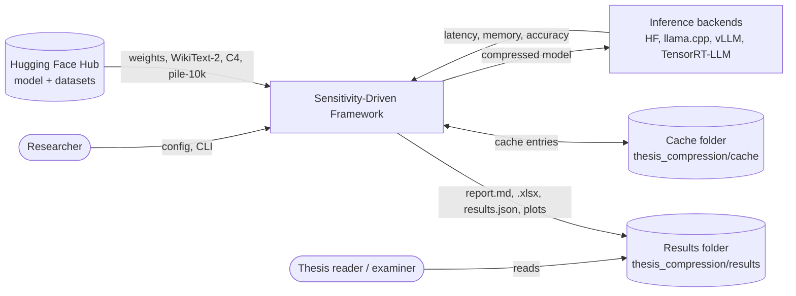

# System Requirements Specification: Sensitivity-Driven Adaptive LLM Compression Framework

| | |
|---|---|
| Document | System Requirements Specification (SyRS) |
| Standard | ISO/IEC/IEEE 29148:2018, clause 9.6 (SyRS content) |
| System | Sensitivity-Driven Framework (`sdf`), MSc thesis codebase |
| Owner | Mohammad (GitHub `hamuutpls`) |
| Version | 0.3 (draft), 2026-09-30 |
| Companion | [Subsystem Design Description](subsystem-design-description.md) (IEEE 1016-2009) |

## Change history

| Version | Date | Change |
|---|---|---|
| 0.1 | 2026-09-29 | First draft, written from the thesis spec (project instructions), the v2_1 architecture diagram and the Stage 0 code on branch `stage0-sensitivity`. |
| 0.2 | 2026-09-30 | S0-01 now names layer removal as the default sensitivity score (Mohammad's decision, 2026-09-30), with one-layer compression and gradient × weight selectable; S0-09 covers ablation scores. New S0-10 to S0-13 for the Stage 0 KV cache plan. MET-06 and S3-02 updated to match. |
| 0.3 | 2026-09-30 | New S0-14 (pruning guard), S0-15 (activation plan for Stage 2) and S0-16 (plans returned and loadable). S2-02 names the activation plan; open issue 3 narrowed to validating it. |

---

## 1. Introduction

### 1.1 System purpose

The framework compresses a large language model (LLM) so that it needs less memory and runs faster, while
losing as little accuracy as possible. Its distinguishing idea is **sensitivity-driven adaptive precision
allocation**: it first measures how fragile each layer of the model is, then spends precision (bits) where it
matters and compresses robust layers harder. The system exists to produce the evidence for an MSc thesis, so
every result must be comparable, reproducible and explained.

*In plain words:* a model is a stack of layers. Some layers break easily when you shrink them, others do not.
The framework finds out which is which and shrinks each one accordingly, then proves, with fair side-by-side
tests, whether this beats shrinking every layer the same way.

### 1.2 System scope

**In scope**

- Stage 0: per-layer sensitivity profiling and a per-layer compression plan (bit width, pruning ratio).
- Stage 1: weight compression (GPTQ, AWQ, structured, unstructured and low-rank pruning).
- Stage 2: activation compression (SmoothQuant, QuaRot, RPTQ, SpinQuant).
- Stage 3: KV-cache compression (QuaRot KV, KVQuant, H2O, SnapKV, InfiniGen).
- Stage 4: evaluation across inference backends (HF Transformers, llama.cpp, vLLM, TensorRT-LLM).
- A search layer that tunes the framework's hyperparameters with three multi-objective searchers (MOBO,
  MFBO, NSGA-III) and benchmarks those searchers against each other.
- Reporting for every stage and for the whole run, readable by both specialists and non-specialists.

**Out of scope**

- Training or fine-tuning models (the framework only compresses a pre-trained model).
- Serving compressed models in production.
- Models other than decoder-only Llama-family models (TinyLlama-1.1B-Chat is the reference model; the code
  should not assume it, but other families are not validated).

### 1.3 System overview

#### 1.3.1 System context

The framework runs on Google Colab (outputs on Google Drive) or on a local GPU machine (the reference local
machine is a Windows PC with an RTX 5070 Ti, 16 GB).

#### 1.3.2 System functions

| ID | Function | Status |
|---|---|---|
| F-1 | Load one configuration, fix seeds, create a run folder, capture the environment. | Implemented |
| F-2 | Profile per-layer sensitivity and build a compression plan (Stage 0). | Implemented |
| F-3 | Apply the plan to weights (Stage 1), activations (Stage 2) and KV cache (Stage 3), each independently. | Planned |
| F-4 | Measure accuracy, memory, latency and build cost under identical conditions. | Implemented for HF backend |
| F-5 | Evaluate the compressed models on several inference backends (Stage 4). | Planned |
| F-6 | Search the hyperparameters with three searchers and benchmark them. | Planned |
| F-7 | Report each stage, the search and the whole run. | Implemented per stage; master report planned |

#### 1.3.3 User characteristics

| User | Knowledge | Needs |
|---|---|---|
| Researcher (the author) | ML engineering, Python, PyTorch | Run stages, change settings without code edits, resume after a Colab disconnect, trust the numbers. |
| Supervisor / examiner | ML research | Trace every claim to a requirement, a configuration and a measurement; see that comparisons are fair. |
| Non-specialist reader | None in AI | Understand what was done, what came out and why, from the report alone. |

### 1.4 Definitions

| Term | Meaning |
|---|---|
| Variant | One of three versions of a method compared in every stage: **fp16** (uncompressed baseline), **original** (the method with its defaults and no Stage 0 plan), **framework** (Stage 0 plan + the method with searched hyperparameters). |
| Compression plan | Per decoder layer: bit width, pruning ratio, protected flag, sensitivity score. Output of Stage 0. |
| Sensitivity | How much the model's loss is expected to change if a layer's weights are perturbed. |
| Validation half / held-out half | The WikiText-2 test split cut into fixed-length windows; the first half is used for tuning, the second half is only reported. |
| DeploymentRequirement | Target upper bounds (latency, memory, perplexity, KV budget) for a hardware profile; each result reports whether it meets them and by how much it falls short. |
| Candidate / trial | One assignment of values to the search-space parameters, and its evaluation. |
| Pareto front | The candidates that no other candidate beats on every objective at once. |
| Hypervolume | The volume of objective space dominated by a Pareto front; larger is better. |
| KV cache | The model's stored keys and values from earlier tokens, its short-term memory during generation. |

The plain-language glossary used in reports is in `src/sdf/reporting/reporter.py` (`BASE_GLOSSARY`).

### 1.5 Requirement conventions

- **Shall** marks a requirement; **should** a goal; **may** an option.
- **Priority:** M = mandatory for the thesis, D = desirable.
- **Status:** Implemented, Partial (some of it exists), Planned.
- **Verification** (29148 §6.5): **I** inspection, **A** analysis, **D** demonstration, **T** test.
- **Source:** SPEC = thesis spec (project instructions); DIAG = v2_1 architecture diagram; DEC = a design
  decision recorded in the CHANGELOG.
- Each requirement traces to a design section (`SDD §x`) in the [SDD](subsystem-design-description.md).

---

## 2. References

| Ref | Document |
|---|---|
| [29148] | ISO/IEC/IEEE 29148:2018, *Systems and software engineering: Life cycle processes, Requirements engineering* |
| [1016] | IEEE 1016-2009, *IEEE Standard for Information Technology: Systems Design, Software Design Descriptions* |
| [42010] | ISO/IEC/IEEE 42010:2022, *Software, systems and enterprise engineering: Architecture description* |
| [SPEC] | Thesis specification (project instructions: pipeline, per-stage protocol, engineering and search requirements) |
| [DIAG] | `v2_1.drawio`, architecture diagram of the framework (8 pages) |
| [UML] | [`docs/diagrams/`](../diagrams/README.md), class and sequence diagrams per stage |
| [GPTQ] Frantar et al., 2023; [AWQ] Lin et al., 2024; [SmoothQuant] Xiao et al., 2023; [QuaRot] Ashkboos et al., 2024; [RPTQ] Yuan et al., 2023; [SpinQuant] Liu et al., 2024; [KVQuant] Hooper et al., 2024; [H2O] Zhang et al., 2023; [SnapKV] Li et al., 2024; [InfiniGen] Lee et al., 2024; [NSGA-III] Deb and Jain, 2014 | Method papers |

---

## 3. System requirements

### 3.1 Functional requirements

#### 3.1.1 Pipeline structure (PIPE)

| ID | Requirement | Pri | Status | Ver | Source | Design |
|---|---|---|---|---|---|---|
| PIPE-01 | The system shall run the pipeline as Stage 0 (plan), Stages 1, 2 and 3 (compression), and Stage 4 (evaluation). | M | Partial | I | SPEC | SDD §3 |
| PIPE-02 | Stages 1, 2 and 3 shall each apply independently on top of the same Stage 0 plan; no one of them shall require another's output. | M | Planned | I, T | SPEC | SDD §3.2 |
| PIPE-03 | Stage 0 shall hand its plan to later stages as a serialised `CompressionPlan` (JSON), so a later stage can run in a separate process from a saved plan. | M | Implemented | T | DEC | SDD §5.4 |
| PIPE-04 | The reference model shall be TinyLlama-1.1B-Chat-v1.0; the model shall be a configuration value, not a constant in stage code. | M | Implemented | I | SPEC | SDD §4.1 |

#### 3.1.2 Configuration and run management (CFG)

| ID | Requirement | Pri | Status | Ver | Source | Design |
|---|---|---|---|---|---|---|
| CFG-01 | All settings shall live in one configuration object (`FrameworkConfig`), loadable from YAML and overridable per key from the command line. | M | Implemented | T | SPEC | SDD §4.1 |
| CFG-02 | Unknown configuration keys shall be rejected with an error naming the key. | M | Implemented | T | DEC | SDD §4.1 |
| CFG-03 | Every run shall write a snapshot of the full resolved configuration to its run folder. | M | Implemented | I | SPEC | SDD §4.2 |
| CFG-04 | Seeds for Python, NumPy and PyTorch shall be fixed from the configuration and logged. | M | Implemented | T | SPEC | SDD §4.2 |
| CFG-05 | Outputs shall be written to `<output_root>/<run_id>/stage_<N>/`; a run without a given `run_id` shall get one from the timestamp and a hash of the configuration. | M | Implemented | T | SPEC | SDD §4.2 |
| CFG-06 | Re-using a `run_id` shall resume into the same folder without losing completed results. | M | Implemented | D | DEC | SDD §4.2 |
| CFG-07 | Logging shall be timestamped and written both to the console and to `run.log` in the run folder. | M | Implemented | I | SPEC | SDD §4.2 |
| CFG-08 | Every stage report shall record the environment: Python, platform, package versions, GPU, CUDA. | M | Implemented | I | SPEC | SDD §4.2 |

#### 3.1.3 Comparison protocol (CMP), applies to every stage

| ID | Requirement | Pri | Status | Ver | Source | Design |
|---|---|---|---|---|---|---|
| CMP-01 | For each method, each stage shall compare three variants: **fp16**, **original** (method defaults, no Stage 0) and **framework** (Stage 0 plan + method, best searched hyperparameters). | M | Implemented (Stage 0) | T | SPEC | SDD §4.3 |
| CMP-02 | All variants of a comparison shall run under identical conditions (calibration dataset and sample count, seed, evaluation data, hardware, backend), and the report shall record those conditions. | M | Implemented | I | SPEC | SDD §4.3 |
| CMP-03 | For each metric the report shall give the absolute and percentage difference against fp16 and against the original variant. | M | Implemented | T | SPEC | SDD §4.3 |
| CMP-04 | Each row shall state whether the `DeploymentRequirement` is met, and if not, the shortfall per target. | M | Implemented | T | SPEC | SDD §4.4 |
| CMP-05 | Results for fp16 and for the original variant shall be cached, keyed by every setting that determines them, and reused by later runs and trials. | M | Partial (fp16 cached; original-method cache arrives with Stages 1–3) | T | SPEC | SDD §4.5 |
| CMP-06 | A failure in one method or variant shall be recorded in the report (error and traceback) and shall not stop the other rows of the stage. | M | Implemented | T | SPEC | SDD §4.3 |
| CMP-07 | When the framework's plan uses more memory than the original, the stage should also report a size-matched framework plan, so accuracy is compared at equal memory. | D | Implemented (Stage 0) | T | DEC | SDD §5.4 |

#### 3.1.4 Measurements (MET)

| ID | Requirement | Pri | Status | Ver | Source | Design |
|---|---|---|---|---|---|---|
| MET-01 | The system shall measure perplexity on the WikiText-2 test split, cut into non-overlapping windows, as two fixed contiguous halves: validation and held-out. | M | Implemented | T | SPEC | SDD §4.6 |
| MET-02 | No tuning, search or selection shall use the held-out half; it shall only be reported. | M | Implemented (by construction) | I, A | SPEC | SDD §4.6, §10 |
| MET-03 | The system shall evaluate downstream tasks (task suite to be fixed with Stage 4). | M | Planned | T | SPEC | SDD §9 |
| MET-04 | The system shall measure model size on disk. | M | Implemented | T | SPEC | SDD §4.6 |
| MET-05 | The system shall measure peak GPU memory. | M | Implemented | T | SPEC | SDD §4.6 |
| MET-06 | The system shall measure KV-cache memory. | M | Partial (predicted in Stage 0; measured in Stage 3) | T | SPEC | SDD §5.8, §8 |
| MET-07 | The system shall measure prefill latency, per-token decode latency and tokens per second, after warmup runs, over repeated runs, reporting mean and standard deviation and keeping every raw repeat. | M | Implemented | T | SPEC | SDD §4.6 |
| MET-08 | The system shall record build time (time to prepare the compressed model, including profiling). | M | Implemented | I | SPEC | SDD §4.6 |
| MET-09 | Each result shall be sanity-checked: output is valid, perplexity is finite, and memory decreased relative to fp16. A failed check shall appear in the report's anomalies. | M | Partial (finite checks; "memory decreased" check to add) | T | SPEC | SDD §4.3 |

#### 3.1.5 Reporting (REP)

| ID | Requirement | Pri | Status | Ver | Source | Design |
|---|---|---|---|---|---|---|
| REP-01 | All stages shall report through one shared component (`StageReporter`). | M | Implemented | I | SPEC | SDD §4.3 |
| REP-02 | Each stage shall write `report.md` with configuration, environment, comparison table, findings, failures and next steps. | M | Implemented | T | SPEC | SDD §4.3 |
| REP-03 | Each stage shall write `stage_<N>_comparison.xlsx` with sheets Summary (conditional formatting for win/loss vs original), Config, Per-layer, Raw, and a chart. | M | Implemented | T | SPEC | SDD §4.3 |
| REP-04 | Each stage shall write `results.json` with the same data, machine-readable. | M | Implemented | T | SPEC | SDD §4.3 |
| REP-05 | `results.json` shall be rewritten after every completed row, and writes shall be atomic, so a disconnect loses at most the row in progress. | M | Implemented | T | SPEC | SDD §4.3 |
| REP-06 | Every report shall be understandable by a reader with no AI background: a plain-language part (what was done, what came out, why, glossary) ahead of the technical tables. | M | Implemented | I | User preference, 2026-09-28 | SDD §4.3 |
| REP-07 | At the end of a full run the system shall write `all_stages_comparison.xlsx` and a master report. | M | Planned | T | SPEC | SDD §4.7 |
| REP-08 | Text outputs shall be UTF-8 on every platform (including Windows). | M | Implemented | T | DEC | SDD §4.3 |
| REP-09 | Every report shall describe the original model (parameters, layers, hidden size, attention and key/value heads, vocabulary, maximum context, number format, size at 16 bits), read from the model's config, with a plain-language meaning for each. | M | Implemented | T | User request, 2026-09-30 | SDD §4.3 |

#### 3.1.6 Stage 0: sensitivity profiling and planning (S0)

| ID | Requirement | Pri | Status | Ver | Source | Design |
|---|---|---|---|---|---|---|
| S0-01 | Stage 0 shall score each decoder layer's sensitivity, by default as the rise in calibration perplexity when that layer alone is skipped (layer removal). The rise when only that layer is compressed (`layer_quant`) and gradient × weight saliency (`grad_x_weight`) shall be selectable through `stage0.score`. | M | Implemented | T | SPEC, DIAG, DEC (2026-09-30) | SDD §5.3 |
| S0-02 | Scores shall be normalised to [0, 1]; rank normalisation shall be the default and min-max selectable. | M | Implemented | T | DEC | SDD §5.3 |
| S0-03 | Stage 0 shall flag outlier layers (robust z-score > 3.5) in the report. | D | Implemented | T | DEC | SDD §5.3 |
| S0-04 | Stage 0 shall produce a per-layer plan: layers at or above `sensitive_threshold` protected (8-bit, no pruning), others compressed (4-bit, pruned at `prune_ratio_aggressive`). | M | Implemented | T | SPEC | SDD §5.4 |
| S0-05 | Stage 0 shall predict, for each plan, weight memory, average bits per weight, sparsity and sensitivity exposure. | M | Implemented | T | SPEC | SDD §5.4 |
| S0-06 | Stage 0's original variant shall be a uniform allocation (every layer 4-bit, no pruning). | M | Implemented | I | DEC | SDD §5.4 |
| S0-07 | Stage 0 shall report per-layer scores, bits and pruning ratios. | M | Implemented | T | SPEC | SDD §5.4 |
| S0-08 | The sensitivity profile shall be cached by model and calibration settings and reused across trials. | M | Implemented | T | SPEC | SDD §5.5 |
| S0-09 | Gradient profiling shall detect non-finite scores and fail with a message pointing at `stage0.profile_dtype`; ablation profiling shall cap a non-finite perplexity so the layer still ranks as most sensitive. | M | Implemented | T | DEC | SDD §5.6 |
| S0-10 | Stage 0 shall plan key bits and value bits per decoder layer from the measured calibration perplexity rise when only that layer's keys (or values) are rounded to each of `kv_bits_options`, spending the same average bits as the uniform KV cache (`kv_uniform_bits`). | M | Implemented | T | DEC (2026-09-30) | SDD §5.8 |
| S0-11 | Stage 0 shall plan a token budget per decoder layer: the fewest of `kv_keep_ratios` whose most-attended tokens still receive `kv_attention_coverage` of the layer's attention. | M | Implemented | T | DEC (2026-09-30) | SDD §5.8 |
| S0-12 | Stage 0 shall predict KV cache memory at `kv_context_len` tokens × `kv_batch_size` for the FP16 cache, the uniform cache and each plan. | M | Implemented | T | DEC (2026-09-30) | SDD §5.8 |
| S0-13 | Stage 0 shall report the KV cache as rows original (uniform bits, no eviction), framework (bits and token budget) and framework bits only (no eviction), and save the KV profile and plans as JSON. | M | Implemented | T | DEC (2026-09-30) | SDD §5.8 |
| S0-14 | No framework plan shall prune the `guard_top_k` layers with the highest layer-removal score, whichever score sets the bits; a removal profile shall be measured (and cached) when another score is used. | M | Implemented | T | DEC (2026-09-30) | SDD §5.4 |
| S0-15 | Stage 0 shall plan activation bits per decoder layer for Stage 2: `act_protected_bits` for layers the weight plan protects or guards, `act_compressed_bits` elsewhere; the original variant is `act_uniform_bits` everywhere. Reported as rows `activations/original` and `activations/framework` and saved as `activation_plan.json`. | M | Implemented | T | DEC (2026-09-30) | SDD §5.9 |
| S0-16 | `run_stage0` shall return every plan (threshold, same-size, same-size without pruning, activation, KV cache) and each plan class shall load its saved JSON (`CompressionPlan.load`, `ActivationPlan.load`, `KVPlan.load`). | M | Implemented | T | DEC (2026-09-30) | SDD §5.2 |

#### 3.1.7 Stage 1: weight compression (S1)

| ID | Requirement | Pri | Status | Ver | Source | Design |
|---|---|---|---|---|---|---|
| S1-01 | Stage 1 shall support GPTQ, AWQ, structured pruning, unstructured pruning and low-rank decomposition. | M | Planned | T | SPEC | SDD §6 |
| S1-02 | In the framework variant, each layer's bit width and pruning ratio shall come from the Stage 0 plan. | M | Planned | T | SPEC | SDD §6 |
| S1-03 | GPTQ group size shall be the search parameter `gptq_groupsize`. | M | Planned | I | SPEC | SDD §6 |
| S1-04 | Stage 1 shall measure real (not predicted) size and accuracy, and report predicted vs measured memory. | M | Planned | T | SPEC | SDD §6 |

#### 3.1.8 Stage 2: activation compression (S2)

| ID | Requirement | Pri | Status | Ver | Source | Design |
|---|---|---|---|---|---|---|
| S2-01 | Stage 2 shall support SmoothQuant, QuaRot, RPTQ and SpinQuant. | M | Planned | T | SPEC | SDD §7 |
| S2-02 | In the framework variant, per-layer activation precision shall follow the Stage 0 activation plan (`activation_plan.json`, S0-15). | M | Planned | T | SPEC | SDD §7 |
| S2-03 | SmoothQuant's migration strength shall be the search parameter `smoothquant_alpha`. | M | Planned | I | SPEC | SDD §7 |

#### 3.1.9 Stage 3: KV-cache compression (S3)

| ID | Requirement | Pri | Status | Ver | Source | Design |
|---|---|---|---|---|---|---|
| S3-01 | Stage 3 shall support QuaRot KV, KVQuant, H2O, SnapKV and InfiniGen. | M | Planned | T | SPEC | SDD §8 |
| S3-02 | In the framework variant, per-layer key bits, value bits and token budget shall follow the Stage 0 KV cache plan (`kv_cache_plan.json`). | M | Planned | T | SPEC | SDD §8 |
| S3-03 | QuaRot key-cache bit width shall be the search parameter `quarot_k_bits`. | M | Planned | I | SPEC | SDD §8 |
| S3-04 | Stage 3 shall report KV-cache memory and check it against `kv_budget_gb`. | M | Planned | T | SPEC | SDD §8 |

#### 3.1.10 Stage 4: evaluation across backends (S4)

| ID | Requirement | Pri | Status | Ver | Source | Design |
|---|---|---|---|---|---|---|
| S4-01 | Stage 4 shall evaluate compressed models on HF Transformers, llama.cpp, vLLM and TensorRT-LLM. | M | Partial (HF measurement exists) | T | SPEC | SDD §9 |
| S4-02 | Each backend shall report the same metrics (MET-01 to MET-08) under the same conditions. | M | Planned | T | SPEC | SDD §9 |
| S4-03 | A backend that cannot load a format shall be recorded as unsupported for that row, not crash the stage. | M | Planned | T | SPEC (error capture) | SDD §9 |

#### 3.1.11 Search (SRCH)

| ID | Requirement | Pri | Status | Ver | Source | Design |
|---|---|---|---|---|---|---|
| SRCH-01 | The search space shall be defined in one place and contain `sensitive_threshold`, `prune_ratio_aggressive`, `gptq_groupsize`, `smoothquant_alpha`, `quarot_k_bits`, `calib_dataset`, `calib_samples`. | M | Partial (5 of 7; `smoothquant_alpha`, `quarot_k_bits` arrive with Stages 2 and 3) | T | SPEC | SDD §10 |
| SRCH-02 | Adding a parameter to the space shall be a one-line change. | D | Implemented | T | DEC | SDD §10 |
| SRCH-03 | Search objectives shall be validation perplexity, memory, latency and build cost. Held-out perplexity shall be measured for every trial but never optimised. | M | Planned | I, A | SPEC | SDD §10 |
| SRCH-04 | The system shall provide three searchers, MOBO (Optuna), MFBO (successive halving) and NSGA-III (pymoo), run on the same space and the same trial budget, and kept separate (not pooled). | M | Planned | T | SPEC | SDD §10 |
| SRCH-05 | The searchers shall be benchmarked on efficiency, speed-to-best, hypervolume and share of the combined Pareto front. | M | Planned | T | SPEC | SDD §10 |
| SRCH-06 | Trials that miss the `DeploymentRequirement` shall be kept and record their shortfall. | M | Planned (check exists) | T | SPEC | SDD §10 |
| SRCH-07 | Full per-stage comparisons shall run only for the final Pareto candidates and the best configuration per objective. | M | Planned | I | SPEC | SDD §10 |
| SRCH-08 | The search shall write, under `results/<run_id>/search/`: `search_report.md`; `search_results.xlsx` with sheets Trials, Pareto, Searcher comparison, Best configs; Pareto plots (accuracy vs memory, accuracy vs latency); hypervolume-over-trials per searcher. | M | Planned | T | SPEC | SDD §10 |

### 3.2 Usability requirements

| ID | Requirement | Pri | Status | Ver |
|---|---|---|---|---|
| USE-01 | Each stage shall be runnable from one command (e.g. `sdf-stage0 --config ... --set key=value`) that prints the output paths. | M | Implemented (Stage 0) | D |
| USE-02 | The same code shall run on Colab and on a local Windows machine, with only the YAML paths differing. | M | Implemented | D |
| USE-03 | Error messages shall name the setting to change when a failure has a configuration cause. | D | Implemented | I |

### 3.3 Performance requirements

| ID | Requirement | Pri | Status | Ver |
|---|---|---|---|---|
| PERF-01 | Stage 0 profiling of TinyLlama shall fit in 16 GB of GPU memory (float32 needs about 9 GB; bfloat16 is selectable). | M | Implemented | D |
| PERF-02 | A search trial shall not repeat profiling or fp16 measurement when their inputs are unchanged (see S0-08, CMP-05). | M | Implemented (Stage 0) | T |
| PERF-03 | The trial budget shall be a configuration value, identical for all three searchers. | M | Planned | I |

### 3.4 System interfaces

| ID | Interface | Direction | Requirement |
|---|---|---|---|
| IF-01 | Hugging Face Hub | in | Models and datasets shall be loaded by name from configuration (`model.name`, `data.sources`). |
| IF-02 | File system / Google Drive | out | Outputs and cache shall be plain files (Markdown, JSON, XLSX, PNG) under configurable roots. |
| IF-03 | Command line | in | `--config <yaml>` and repeated `--set key=value` (values parsed as YAML). |
| IF-04 | Inference backends | in/out | Stage 4 shall talk to each backend through one `Backend` interface (load, generate, measure). Planned. |
| IF-05 | Optuna, pymoo | in/out | Searchers shall wrap these libraries behind one `ask` / `tell` interface. Planned. |
| IF-06 | Stage-to-stage | internal | `CompressionPlan` JSON (Stage 0 to Stages 1–3); `results.json` per stage (to the master report). |

### 3.5 System operations

| ID | Requirement | Pri | Status |
|---|---|---|---|
| OPS-01 | **Single-run mode:** run one stage with one candidate from configuration. | M | Implemented (Stage 0) |
| OPS-02 | **Search mode:** run the searchers, then the full comparisons on the final candidates. | M | Planned |
| OPS-03 | **Resume:** restart after a disconnect with the same `run_id`; cached artifacts and completed rows are reused. | M | Implemented |

### 3.6 System modes and states

A stage row moves through `running` → `ok` or `failed` (see SDD §4.3). A run is *new* or *resumed*. The search
moves through *searching* → *front selection* → *full comparison* → *master report*.

### 3.7 Physical and environmental characteristics

| ID | Requirement |
|---|---|
| ENV-01 | Python ≥ 3.10; PyTorch ≥ 2.1; Transformers ≥ 4.40; Datasets ≥ 2.18; openpyxl ≥ 3.1; PyYAML ≥ 6.0 (see `pyproject.toml`). |
| ENV-02 | Reference platforms: Google Colab GPU runtime (T4 or better); Windows PC with RTX 5070 Ti (16 GB). CPU-only runs shall work for tests. |

### 3.8 Security and information management

| ID | Requirement |
|---|---|
| SEC-01 | No credentials shall be stored in the repository or in reports; Hub tokens come from the environment. |
| INF-01 | Cache entries shall store their full key next to the value, so any cached number can be traced to its inputs. |
| INF-02 | Raw measurements (per-window NLL, per-repeat latency) shall be kept in the Raw sheet and `results.json`. |

### 3.9 Policies and regulations

Not applicable: public pre-trained models and public datasets under their own licences; no personal data.

### 3.10 Life-cycle sustainment (maintainability)

| ID | Requirement | Status |
|---|---|---|
| MNT-01 | Code shall be split into small testable functions with unit tests (pytest), including an end-to-end test on a tiny random Llama. | Implemented |
| MNT-02 | Non-obvious code shall be commented with its reason. | Implemented |
| MNT-03 | Every change shall be recorded in `CHANGELOG.md`. | Implemented |
| MNT-04 | A new stage shall add its own `StageNConfig` block, reuse `StageReporter`, `ArtifactCache` and `measure_model`, and add only its methods. | Planned (design rule) |

---

## 4. Verification

| Method | How it is done here |
|---|---|
| Inspection (I) | Reading the code, configuration snapshot or report. |
| Analysis (A) | Reasoning over data flow, e.g. confirming the held-out half never reaches an objective. |
| Demonstration (D) | Running the CLI on Colab or the local PC and checking the outputs exist and are complete. |
| Test (T) | Automated pytest in `tests/`. |

Current automated coverage (`main`):

| Test file | Requirements covered |
|---|---|
| `tests/test_config.py` | CFG-01, CFG-02, SRCH-01 (partial), SRCH-02, CMP-04, IF-01 |
| `tests/test_stage0.py` | S0-01 … S0-05, S0-07, S0-14 … S0-16, CMP-07, MET-01, MET-04 … MET-07, PIPE-03 (end-to-end) |
| `tests/test_kv_cache.py` | S0-10 … S0-12, MET-06 (predicted) |
| `tests/test_reporting.py` | REP-02 … REP-06, REP-08, CMP-03, CMP-06 |

A full requirement-to-design-to-code matrix is in [SDD Appendix A](subsystem-design-description.md#appendix-a-traceability).

---

## 5. Appendices

### 5.1 Assumptions and dependencies

- Hugging Face Hub is reachable from the run environment (not from every cloud sandbox).
- The model is decoder-only with its layers at `model.model.layers` (a fallback finds the longest `ModuleList`).
- Predicted memory assumes pruned weights cost nothing to store, which holds for structured pruning; unstructured
  sparsity needs a sparse format to realise it (see `predict_cost`).

### 5.2 Open issues

| # | Issue |
|---|---|
| 1 | Downstream task suite (MET-03) not yet chosen. |
| 2 | "Memory decreased" sanity check (MET-09) to be added to `StageReporter`. |
| 3 | The Stage 0 activation plan (S0-15) is derived from the weight plan, not measured: it assumes a layer fragile for weights is fragile for activations. Stage 2 should check this against a measured per-layer activation sensitivity. Stage 3 follows the Stage 0 KV cache plan (S0-10 to S0-13). |
| 4 | The fidelity schedule for MFBO (which cheaper evaluation stands in for the full one) to be fixed with the search layer. |

### 5.3 Acronyms

AWQ activation-aware weight quantisation; GPTQ generative pre-trained transformer quantisation; KV key-value;
LLM large language model; MAD median absolute deviation; MFBO multi-fidelity Bayesian optimisation; MOBO
multi-objective Bayesian optimisation; NLL negative log-likelihood; NSGA non-dominated sorting genetic algorithm;
ppl perplexity; SyRS system requirements specification; SDD software design description.
